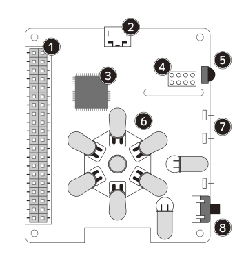
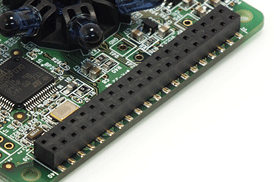
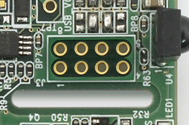
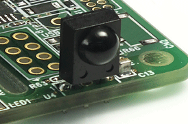
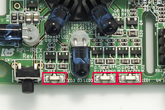
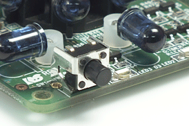
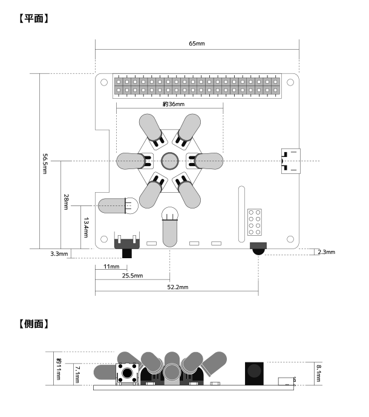

### **基板構成と主要部品名称**  

#### A ）基板構成  
RPi-IREXの基板構成は以下のとおりです。  
  
  
  
| No | 名称 | 説明 |
|:-----:|:-----|:-----|
|1|GPIO40PINピンヘッダ|RaspberryPi2および3に準拠したGPIOピンヘッダです。|
|2|USB接続コネクタ|Raspberry PiとUSBで接続する際に使用します。|
|3|制御用マイコン|RPi-IREXの制御マイコンです。|
|4|8PINピンヘッダ実装用切穴|I2C8PINピンヘッダ搭載可能なスルーホールです。|
|5|赤外線受光部|リモコンのコードを学習する際に使用する受光部です。|
|6|IR出力LED（全天球型）|IR出力用全天球型LEDです。|
|7|インジーケーターLEDランプ|RPi-IREXの動作ステータスを表示する赤/緑の2色LEDです。|
|8|タクトスイッチ|GPIOピン動作用スイッチです。|
  
---  

#### B ）GIPOピンコネクタ仕様  
RPi-IREXのGPIOピンコネクタ配列及び仕様は以下のとおりです。  
  
  
[GPIO 40PIN ピンコネクタ 配列](./img/rdm/gpio_list.png)  
  
| PIN# | 名称 | 説明 | PIN# | 名称 | 説明 |
|:---:|:---|:---|:---:|:---|:---|
|1|3.3V*|3.3V電源|2|5V|5V電源|
|3|SDA1/GPIO 2|I2C/SDA1（未使用）|4|5V|5V電源|
|5|SCL1/GPIO 3|I2C/SCL1（未使用）|6|GND|GND|
|7|GPIO 4|SW１用 ON:Lo / OFF:Hi|8|GPIO 14/TXD|RPi-IREX制御用UART信号（出力）|
|9|GND|GND|10|GPIO 15/RXD|RPi-IREX制御用UART信号（入力）|
|11|GPIO 17|赤LED（LED3）用（出力）|12|GPIO 18|緑LED（LED3）用（出力）|
|13|GPIO 27|RaspPiのGPIOからRPi-IREXの制御MPUへ直結|14|GND|GND|
|15|GPIO 22|制御MPUリセット用|16|GPIO 23|microUSBのVbus入力検知|
|17|3.3V|3.3V電源|18|GPIO 24|（未使用）|
|19|MOSI/GPIO 10|DPI/MOSI（未使用）|20|GND|GND|
|21|MISO/GPIO 9|SPI/MISO（未使用）|22|GPIO 25|（未使用）|
|23|SDA1/GPIO 11|SPI SCLK（未使用）|24|CE0/GPIO 8|SPI CE0（未使用）|
|25|GND|GND|26|CE1/GPIO 7|SPI CE1（未使用）|
|27|ID_SD/GPIO 0|I2C ID_SD（入出力）|28|ID_SC/GPIO 1|I2C ID_SC（出力）|
|29|GPIO 5|（未使用）|30|GND|GND|
|31|GPIO 6|（未使用）|32|GPIO 12|（未使用）|
|33|GPIO 13|（未使用）|34|GND|GND|
|35|GPIO 19|（未使用）|36|GPIO 16|（未使用）|
|37|GPIO 26|（未使用）|38|GPIO 20|（未使用）|
|39|GND|GND|40|GPIO 21|（未使用）|
  
---  

#### C ） I2C 8PIN スルーホール  
I2C 8PINスルーホールの配列は以下のとおりです。  
※本製品にピンヘッダーは実装されていません。ご使用になる場合はお客様での実装作業が必要です。   
  
     
  
<table>
<tr><td width="30%" colspan="2">PIN番号および名称</td><td>動作仕様および説明</td></tr>
<tr><td>1</td><td>5V</td><td>5V電源</td></tr>
<tr><td>2</td><td>NC</td><td>使用しないでください</td></tr>
<tr><td>3</td><td>NC</td><td>使用しないでください</td></tr>
<tr><td>4</td><td>GND</td><td>GND</td></tr>
<tr><td>5</td><td>GND</td><td>GND</td></tr>
<tr><td>6</td><td>SCL1</td><td>I2C（入力）GPIO40pinのSCL1（#5pin）が接続</td></tr>
<tr><td>7</td><td>SDA1</td><td>I2C（入出力）GPIO40pinのSDA1（#3pin）が接続</td></tr>
<tr><td>8</td><td>3.3V</td><td>3.3V電源</td></tr>
</table>
  
---

#### D ） 赤外線受光部  
  
     
  
赤外線受光部は、リモコン学習用センサです。学習させる際は、お手持ちのリモコン送信機を受光部に向けてご使用ください。  
  
---

#### E ） インジケーター LED  
インジケーター LEDランプの動作パターンは以下のとおりです。  

     

<table>
<tr>
  <td>LED番号</td><td>色</td><td>状態</td><td>動作仕様</td>
</tr><tr>
  <td rowspan="4">LED1</td><td rowspan="2">赤</td><td>点灯</td><td>UARTモード（GPIO40PIN接続）時に点灯</td>
</tr><tr>
  <td>点滅</td><td>UARTモードで赤外線信号の出力時に点滅</td>
</tr><tr>
  <td rowspan="2">緑</td><td>点灯</td><td>USBモード（USB接続）時に点灯</td>
</tr><tr>
  <td>点滅</td><td>USBモードで赤外線信号の出力時に点滅</td>
</tr><tr>
  <td>LED2</td><td>赤</td><td>点灯</td>
  <td>赤外線信号学習モード時に点灯</td>
</tr><tr>
  <td rowspan="2">LED3</td><td>赤</td><td>点灯</td><td>GPIO17（11pin）で制御が可能です（Hi：点灯/Lo：消灯）</td>
</tr><tr>
  <td>緑</td><td>点灯</td><td>GPIO18（12pin）で制御が可能です（Hi：点灯/Lo：消灯）</td>
</tr>
</table>
  
---  
  

#### F ） タクトスイッチ  
タクトスイッチの動作パターンは以下のとおりです。  
  
     
  
<table>
<tr><td colspan="2">状態</td><td>動作仕様</td></tr>
<tr><td>押す</td><td>ON</td><td>GPIO40pinの 7番ピンにLoを入力します</td></tr>
<tr><td>離す</td><td>OFF</td><td>GPIO40pinの 7番ピンにHiを入力します</td></tr>

<table>  
  
---  
  
#### G） 基板寸法  
基板寸法は以下のとおりです。  
  
  
  
  
