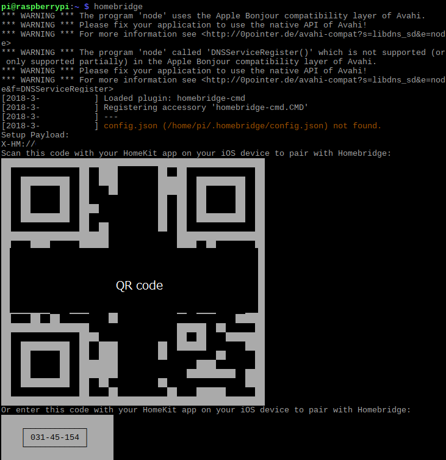
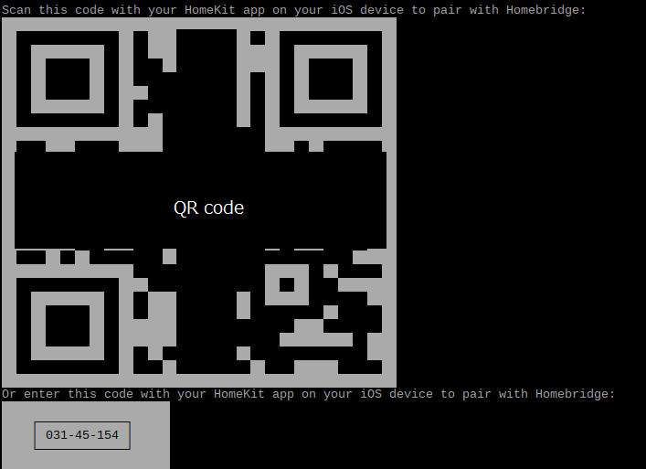
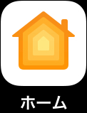
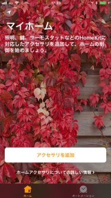
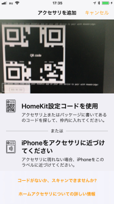
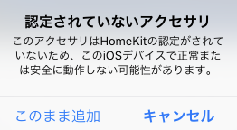
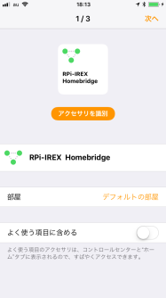
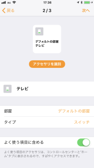
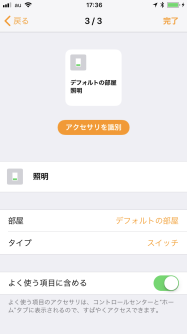
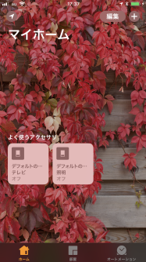

# HomebridgeでRPi-IREXを制御する方法
Homebridgeを使ってRPi-IREXを制御する方法について説明します。  
Raspberry Piは`Raspberry Pi3 ModelB`、OSは`Raspbian Stretch with desktop(NOOBS:2018-03-14)`で説明します。  
  
***
## 準備
### Pythonサンプルファイルを動作させる  
[README.md](../python/README.md)を参考に、Pythonサンプルファイルで赤外線リモコン信号の学習・出力できることを確認してください。  

- 'Raspberry Pi'に'RPi-IREX'を接続  
- OS('Raspbian)のインストール・アップデート
- GPIO40pinのUART設定(GPIO40pin接続の場合)
- Pythonサンプルファイル`irexIn.py`で赤外線リモコン信号を学習する
- Pythonサンプルファイル`irexOut.py`で学習した赤外線リモコン信号を出力する  
  
***
  
### Homebridgeのインストール  
> 下記ページを参考に、Homebridgeの設定を行います。  
> https://github.com/nfarina/homebridge  
> https://github.com/nfarina/homebridge/wiki/Running-HomeBridge-on-a-Raspberry-Pi  
  

1. <u>Node.jsアップデート</u>  
Node.jsをアップデートします。  
**※Node.jsをアップデートするとNode-REDが削除される場合がありますので、Node-REDを使用している場合は、Node-RED用NODEを保存してからアップデートを行ってください**  
  
    "LXTerminal" を起動し、以下のコマンドを実行します。  
    ```
    $ curl -sL https://deb.nodesource.com/setup_8.x | sudo -E bash -  
    ```  
  
    さらに以下のコマンドを実行します。  
   ```
   $ sudo apt-get install -y nodejs  
   ```  
  

1. <u>Avahiインストール</u>  
以下のコマンドを実行し、Avahiをインストールします。  
    ```
    $ sudo apt-get install libavahi-compat-libdnssd-dev -y  
    ```  

1. <u>Homebridgeインストール</u>  
以下のコマンドを実行し、Homebridgeをインストールします。  
    ```
    $ sudo npm install -g --unsafe-perm homebridge  
    ```  

1. <u>homebridge-cmdプラグインインストール</u>  
HomebidgeからRPi-IREX用PythonサンプルファイルでRPi-IREXを制御できるように`homebridge-cmd`プラグインをインストールします。  
以下のコマンドを実行し、homebridge-cmdをインストールします。  
    ```
    $ sudo npm install -g homebridge-cmd  
    ```  
  
1. <u>Homebridge起動確認</u>  
以下のコマンドを実行し、Homebridgeが起動することを確認します。  
    ```
    $ homebridge  
    ```  
  
    下記のように表示されればHomeBridgeのインストールは完了です。  
    起動確認できましたら、`Ctrl+c`でHomebridgeを終了します。
    
  
***
  
### config.json作成  
config.jsonを作成し、Homebridgeで制御するコマンドを追加します。  
  
1. <u>赤外線リモコン信号ファイルを作成</u>  
  `irexIn.py`を使って、制御したい機器の赤外線信号を学習します。  
  学習する赤外線信号ファイルは、わかりやすい名前で保存してください。  
  例)  
  TVをオン: `tvON.json`  
  照明をつける:`lightON.json`  
  照明を消す:`lightOFF.json`  
  
1. <u>`.homebridge`フォルダに移動</u>  
以下のコマンドを実行し、`.homebridge`フォルダに移動します。  

    ```
    $ cd /home/pi/.homebridge  
    ```  
  
1. <u>サンプル`config.json`ファイルをダウンロード</u>  
以下のコマンドを実行し、サンプルconfig.jsonファイルをダウンロードします。  

    ```
    $ wget https://github.com/ratocsystems/rpi-irex/raw/master/homebridge/config.json  
    ```  
  
1. <u>`config.json`ファイルを編集</u>  
a) 以下のコマンドを実行し、config.jsonファイルを開きます。  

    ```
    $ leafpad config.json  
    ```  

    b) `"bridge"`を設定します  
    `"name":`にBridgeを区別するための名前を設定します。  
    `"username": "00:00:00:00:00:00"`をRaspberry Pi本体のネットワークのMACアドレスに変更します。  
    ```
        "bridge": {
            "name": "RPi-IREX Homebridge",
            "username": "00:00:00:00:00:00",
            "port": 51826,
            "pin": "031-45-156"
        },
    ```  

    > MACアドレスは`ifconfig`コマンドで確認できます  
    > `ether`の後の`XX:XX:XX:XX:XX:XX`がMACアドレスです  

    c) `"accessory"`にコマンドを追加します。  
      - "accessory":  
        `irexOut.py`で制御しますので、`"CMD"`を設定してください
      - "name":  
        制御する機器の名前です。Siriにはこの名前で指示します。
      - "on_cmd":  
        機器をONにするコマンドを設定します。  
        `irexOut.py`の場所と赤外線信号ファイルの場所を含めたコマンドを設定します。  

        例）`irexOut.py`と赤外線信号ファイル`tvON.json`が`/home.pi/RPi-IREX`フォルダにある場合  
        ```
        "python3 /home/pi/RPi-IREX/irexOut.py -d /dev/ttyS0 -f /home/pi/RPi-IREX/tvON.json"
        ```  

      - "off_cmd":  
        "on_cmd"と同様に、機器をOFFにするコマンドを設定します。  

    d) 制御する機器を増やす場合は、下記のように追加します。  

    ```
    "accessories": [
        {
            "accessory": "CMD",
            "name": "テレビ",
            "on_cmd": "python3 /home/pi/RPi-IREX/irexOut.py -d /dev/ttyS0 -f /home/pi/RPi-IREX/tvON.json",
            "off_cmd": "python3 /home/pi/RPi-IREX/irexOut.py -d /dev/ttyS0 -f /home/pi/RPi-IREX/tvON.json"
        },

        {
            "accessory": "CMD",
            "name": "照明",
            "on_cmd": "python3 /home/pi/RPi-IREX/irexOut.py -d /dev/ttyS0 -f /home/pi/RPi-IREX/lightON.json",
            "off_cmd": "python3 /home/pi/RPi-IREX/irexOut.py -d /dev/ttyS0 -f /home/pi/RPi-IREX/lightOFF.json"
        }
    ]
    ```  


    e) `Homebridge`起動  
    config.jsonファイルの編集終わったら保存してファイルを閉じます。  
    以下のコマンドを実行し、Homebridgeを起動します。  
    ```
    $ homebridge  
    ```  

　　

___ 
  
### "ホーム"アプリの設定  
iOSの”ホーム”アプリの設定方法を説明します。  
> iOS 11.3で説明します  

1. `Homebridge`起動し、QRコードを表示させます  
    以下のコマンドを実行し、Homebridgeを起動します。  
    ```
    $ homebridge  
    ```  

    QRコードが表示されます。  
      

1. iOSの”ホーム”アプリを起動します  
  
  
1. `"アクセサリを追加"`をタップします  
  
  
1. カメラでHomebridgeのQRコードを撮影します  
  
  
1. アクセサリを追加します  
`"このまま追加"`をタップしてアクセサリを追加します  
  

1. `アクセサリ(ブリッジ)`が追加されます  
`config.json`ファイルの"bridge"-"name"に設定した名前で追加されます  
  

1. `アクセサリ`が追加されます  
`config.json`ファイルの"accessory"-"name"に設定した名前で追加されます  
  
  
  
1. 追加されたボタンでデバイスを制御します  
機器に対応したボタンをタップすると、`config.json`ファイルの"accessory"-"on_cmd/off_cmd"に設定した赤外線信号が出力されます  
  
  
1. `Siri`でデバイスを制御します  
"accessory"-"name"に設定した名前を使って`Siri`で制御できます  
  
    例）  
    "テレビをオン"  
    Siri: "はい、テレビをオンにしました"  
    
    "照明を消して"  
    Siri: "はい、照明をオフにしました"  
    