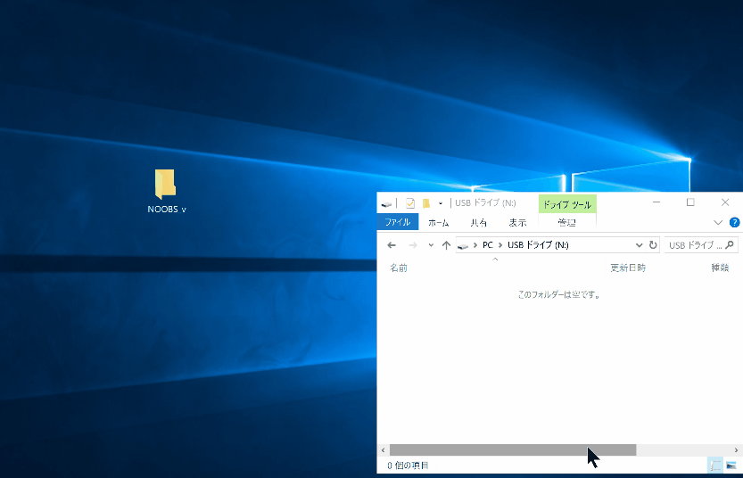

# NOOBSを使ってRaspberry Pi 3 Model Bに「RASPBIAN」をインストールする

----
## SDカードを準備する

1. 8GB以上のmicroSDカードを用意します。

2. SDカード用フォーマッターをダウンロードします。

    SDアソシエーションの[ダウンロードページ](https://www.sdcard.org/jp/downloads/formatter_4/index.html)から'SDメモリカードフォーマッター'をダウンロードしてください。  
    [https://www.sdcard.org/jp/downloads/formatter_4/index.html](https://www.sdcard.org/jp/downloads/formatter_4/index.html)

    

3. 'SDメモリカードフォーマッター'を使って、SDカードをフォーマットします。

    *64GB以上のSDカードの場合、exFATでフォーマットされます。  
    NOOBSはexFATに対応していませんので、別のツールを使ってFAT16またはFAT32でフォーマットする必要があります。*

    

----
## NOOBSをSDカードに保存する

1. Raspberry Piの[ダウンロードページ](https://www.raspberrypi.org/downloads/)から'NOOBS'をダウンロードしてください。  
[https://www.raspberrypi.org/downloads/](https://www.raspberrypi.org/downloads/)

    

2. ダウンロードした'NOOBS_***.zip'ファイルを展開し、展開されたフォルダーの中身をフォーマットしたSDカードにすべてコピーしてください。

    

----
## 'RASPBIAN'をインストールする

1. 'NOOBS'ファイルを保存したSDカードをRaspberry Pi 3 Model B(以下'Raspberry Pi')に挿入してください。

2. 'Raspberry Pi'にキーボート・マウス・モニターを接続して、電源を接続してください。

3. 'NOOBS'が起動したら、"Language"を"日本語"に設定してください。

    

4. "Raspbian"を選択し、"インストール"ボタンを押してください。 
上書きを確認するダイアログで"はい"を押すとインストールが開始されます。  
「OSのインストールに成功しました」のダイアログが表示されたら、"OK"ボタンを押してください。  
自動的に再起動されます。

    

5. デスクトップ画面が表示されればインストール完了です。

    

