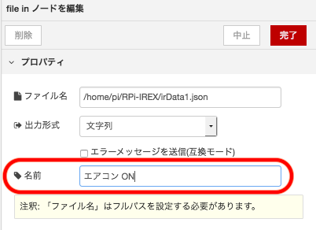

# RPi-IREX用Node-RED サンプルNode
RPi-IREXを制御するためのNode-RED サンプルNodeについて説明します。  
Raspberry Piは'Raspberry Pi3 ModelB'、OSは'Raspbian Stretch with desktop'で説明します。
  
  
***
## 準備
### Raspberry PiにRPi-IREXを接続
[README.md](../setup/README.md)を参考に下記の準備をおこなってください。  

- 'Raspberry Pi'に'RPi-IREX'を接続  
- OS('Raspbian)のインストール・アップデート
- GPIO40pinのUART設定(GPIO40pin接続の場合)
- 'RPi-IREX'が'Raspberry Pi'に認識されていることを確認
  
### RPi-IREX制御インターフェースの確認  
#### UART(GPIO40pin接続)で制御する場合  
"LXTerminal" を起動し、以下のコマンドを実行します。

```
$ ls /dev/ttyS0  
```  

下記のように表示されれば、`/dev/ttyS0`で制御する準備ができています。

```
/dev/ttyS0  
```  

#### USBで制御する場合  
"LXTerminal" を起動し、以下のコマンドを実行します。

```
$ dmesg | grep RPi-IREX -2  
```

下記のように表示されれば、`/dev/ttyACM0`で制御する準備ができています。  
`"cdc_acm 1-1.x:1.0: ttyACM0: USB ACM device"`の`ttyACM0`が、`ttyACM1`や`ttyACM2`の場合は、`/dev/ttyACM1`または`/dev/ttyACM2`で制御します。

```
[xxx.xxx] usb 1-1.x: New USB device found, idVendor=0584, idProduct=007a
[xxx.xxx] usb 1-1.x: New USB device strings: Mfr=1, Product=2, SerialNumber=0
[xxx.xxx] usb 1-1.x: Product: RPi-IREX IR Remote Controller
[xxx.xxx] usb 1-1.x: Manufacturer: RATOC Systems, Inc.
[xxx.xxx] cdc_acm 1-1.x:1.0: ttyACM0: USB ACM device
```  

### Node-RED起動  
"LXTerminal" を起動し、以下のコマンドを実行します。

```
$ node-red-start  
```

下記のように表示されれば、Node-REDの起動が完了です。  

```
Start Node-RED
 
Once Node-RED has started, point a browser at http://192.168.1.136:1880
On Pi Node-RED works better with the Firefox or Chrome browser
 
Use   node-red-stop                          to stop Node-RED
Use   node-red-start                         to start Node-RED again
Use   node-red-log                           to view the recent log output
Use   sudo systemctl enable nodered.service  to autostart Node-RED at every boot
Use   sudo systemctl disable nodered.service to disable autostart on boot
 
To find more nodes and example flows - go to http://flows.nodered.org
 
Starting as a systemd service.
Started Node-RED graphical event wiring tool..
xx xxx xx:xx:xx - [info]
Welcome to Node-RED
===================
...
```  
`"Once Node-RED has started, point a browser at"`の後に書かれているURLを"Web Browser"で開きます。  
(上記の場合は`http://192.168.1.136:1880`です。)  
  
下記のように表示されれば、Node-REDの準備は完了です。  
  
  
***
## Node-REDでの制御方法  
RPi-IREXを制御するためのノードについて説明します。  
各ノードのJSONデータを記載していますので、Node-REDに読み込ませることで使用することができます。  
  
### ノードの読み込み方法  
  
1. 各ノードの説明にある下記のようなJSONデータを全てコピーします　　
  
    ```  
    [{"id":"6997606d.d4c268","type":"comment","z":"c797c48b.b6b498","name":"サンプル","info":"","x":788,"y":467.75,"wires":[]}]  
    ```  
  
2. ブラウザのNode-RED画面の右上にあるメニューを開きます  
    
  
3. メニューの中の`読み込み`-`クリップボード`を選び、コピーしたJSONデータを貼り付けて読み込みを行なってください    
    
  
4. ノードが表示されますので、適当な場所に配置してください  
    
  
5. ノードの追加・変更・移動などを行なった場合は、`デプロイ`を実行してください。  
  ブラウザのNode-RED画面の右上にある`デプロイ`ボタンをクリックすることで実行できます。  
  `デプロイ`が赤色の場合は、`デプロイ`を実行してください。  
    
  `デプロイ`が灰色の場合は、`デプロイ`の必要はありません。  
    
    
### 各ノードの説明  
- **UART(GPIO40pin接続)制御用シリアルノード**  
  GPIO40pin接続時にUARTで制御するためのノードです。  
  コマンドを出力する時に出力用ノード、コマンドを受信する時に入力用ノードを使用します。  
    
  
  ```  
  [{"id":"b1b66241.b32468","type":"serial in","z":"c797c48b.b6b498","name":"UART用入力ノード","serial":"d542a3c0.25fef8","x":301.75,"y":154.75,"wires":[[]]},{"id":"41941b8f.de4924","type":"serial out","z":"c797c48b.b6b498","name":"UART用出力ノード","serial":"d542a3c0.25fef8","x":301.75,"y":195.75,"wires":[]},{"id":"a73cf35e.59c4d","type":"comment","z":"c797c48b.b6b498","name":"UART制御用シリアルノード","info":"","x":303,"y":114.25,"wires":[]},{"id":"d542a3c0.25fef8","type":"serial-port","z":"","serialport":"/dev/ttyS0","serialbaud":"115200","databits":"8","parity":"none","stopbits":"1","newline":"100","bin":"bin","out":"time","addchar":false}]
  ```  
    
  RPi-IREXの制御ができないときは、制御用のデバイスファイルを確認してください。  
  サンプル`UART制御用シリアルノード`は`/dev/ttyS0`が設定されていますので、変更する場合は`UART制御用シリアルノード`をダブルクリックして変更してください。  
    
    
    
    
- **USB制御用シリアルノード**  
  USB接続時に制御するためのノードです。  
  コマンドを出力する時に出力用ノード、コマンドを受信する時に入力用ノードを使用します。  
    
  
  ```  
  [{"id":"3f56a550.6ea2f2","type":"serial out","z":"c797c48b.b6b498","name":"USB用出力ノード","serial":"bcfe1fa8.0daa6","x":289.75,"y":393.75,"wires":[]},{"id":"d0a5affc.619d9","type":"serial in","z":"c797c48b.b6b498","name":"USB用入力ノード","serial":"bcfe1fa8.0daa6","x":287.75,"y":350.75,"wires":[[]]},{"id":"3bd1cc86.8a517c","type":"comment","z":"c797c48b.b6b498","name":"USB制御用シリアルノード","info":"","x":288.75,"y":310.75,"wires":[]},{"id":"bcfe1fa8.0daa6","type":"serial-port","z":"","serialport":"/dev/ttyACM0","serialbaud":"57600","databits":"8","parity":"none","stopbits":"1","newline":"100","bin":"bin","out":"time","addchar":false}]  
  ```  
    
  RPi-IREXの制御ができないときは、制御用のデバイスファイルを確認してください。  
  サンプル`USB制御用シリアルノード`は`/dev/ttyACM0`が設定されていますので、変更する場合は`USB制御用シリアルノード`をダブルクリックして変更してください。  
    
    
    
    

    
- **LED用GPIOノード**(GPIO40pin接続のみ)  
  LED3を制御するためのノードです。  
  LED3は2色(赤と緑)に点灯しますので、ノードが2種類あります。  
  ノードに`1`を入力することで点灯、`0`を入力することで消灯します。  
    
  
  ```  
  [{"id":"329fa714.1703d","type":"rpi-gpio out","z":"c797c48b.b6b498","name":"LED(赤)","pin":"11","set":true,"level":"0","freq":"","out":"out","x":352.75,"y":262.75,"wires":[]},{"id":"8d2d2f20.666d98","type":"rpi-gpio out","z":"c797c48b.b6b498","name":"LED(緑)","pin":"12","set":true,"level":"0","freq":"","out":"out","x":352.3055419921875,"y":307.08343505859375,"wires":[]},{"id":"d4ae6ff2.a7fe28","type":"comment","z":"c797c48b.b6b498","name":"LED用GPIOノード","info":"","x":354,"y":217.75,"wires":[]}]  
  ```  
     
- **タクトスイッチ用GPIOノード**(GPIO40pin接続のみ)  
  タクトスイッチの状態を判定するためのノードです。  
  スイッチを押した時は`0`、離した時は`1`になります。  
    
  
  ```  
  [{"id":"ee65844.fb52d78","type":"rpi-gpio in","z":"c797c48b.b6b498","name":"タクトスイッチ","pin":"7","intype":"tri","debounce":"25","read":false,"x":734.75,"y":293.75,"wires":[[]]},{"id":"2a373534.f6fafa","type":"comment","z":"c797c48b.b6b498","name":"タクトスイッチ用GPIOノード","info":"","x":737,"y":245.75,"wires":[]}]  
  ```  
    
- **リセット用GPIOノード**(GPIO40pin接続のみ)  
  RPi-IREXにハードウェアリセットをかけるためのノードです。  
  ノードに入力される信号が`0`の時にリセットがかかり、`1`になった時にリセットが解除されます。  
    
  
  ```  
  [{"id":"dd77b9d0.4296d","type":"comment","z":"c797c48b.b6b498","name":"リセット用GPIOノード","info":"","x":520,"y":255.75,"wires":[]},{"id":"6b88cb99.47348c","type":"rpi-gpio out","z":"c797c48b.b6b498","name":"リセット","pin":"15","set":true,"level":"1","freq":"","out":"out","x":500.75,"y":298.75,"wires":[]}]  
  ```  
    
- **コマンド送信ファンクションノード**  
  コマンドデータを通信データフォーマットに変換して出力します。  
    
  
  ```  
  [{"id":"194e9c9e.410b5b","type":"function","z":"c797c48b.b6b498","name":"コマンド送信","func":"//// CRCテーブル\nvar CRC8Table = [\n    0x00, 0x85, 0x8F, 0x0A, 0x9B, 0x1E, 0x14, 0x91,\n    0xB3, 0x36, 0x3C, 0xB9, 0x28, 0xAD, 0xA7, 0x22,\n    0xE3, 0x66, 0x6C, 0xE9, 0x78, 0xFD, 0xF7, 0x72,\n    0x50, 0xD5, 0xDF, 0x5A, 0xCB, 0x4E, 0x44, 0xC1,\n    0x43, 0xC6, 0xCC, 0x49, 0xD8, 0x5D, 0x57, 0xD2,\n    0xF0, 0x75, 0x7F, 0xFA, 0x6B, 0xEE, 0xE4, 0x61,\n    0xA0, 0x25, 0x2F, 0xAA, 0x3B, 0xBE, 0xB4, 0x31,\n    0x13, 0x96, 0x9C, 0x19, 0x88, 0x0D, 0x07, 0x82,\n    \n    0x86, 0x03, 0x09, 0x8C, 0x1D, 0x98, 0x92, 0x17,\n    0x35, 0xB0, 0xBA, 0x3F, 0xAE, 0x2B, 0x21, 0xA4,\n    0x65, 0xE0, 0xEA, 0x6F, 0xFE, 0x7B, 0x71, 0xF4,\n    0xD6, 0x53, 0x59, 0xDC, 0x4D, 0xC8, 0xC2, 0x47,\n    0xC5, 0x40, 0x4A, 0xCF, 0x5E, 0xDB, 0xD1, 0x54,\n    0x76, 0xF3, 0xF9, 0x7C, 0xED, 0x68, 0x62, 0xE7,\n    0x26, 0xA3, 0xA9, 0x2C, 0xBD, 0x38, 0x32, 0xB7,\n    0x95, 0x10, 0x1A, 0x9F, 0x0E, 0x8B, 0x81, 0x04,\n    \n    0x89, 0x0C, 0x06, 0x83, 0x12, 0x97, 0x9D, 0x18,\n    0x3A, 0xBF, 0xB5, 0x30, 0xA1, 0x24, 0x2E, 0xAB,\n    0x6A, 0xEF, 0xE5, 0x60, 0xF1, 0x74, 0x7E, 0xFB,\n    0xD9, 0x5C, 0x56, 0xD3, 0x42, 0xC7, 0xCD, 0x48,\n    0xCA, 0x4F, 0x45, 0xC0, 0x51, 0xD4, 0xDE, 0x5B,\n    0x79, 0xFC, 0xF6, 0x73, 0xE2, 0x67, 0x6D, 0xE8,\n    0x29, 0xAC, 0xA6, 0x23, 0xB2, 0x37, 0x3D, 0xB8,\n    0x9A, 0x1F, 0x15, 0x90, 0x01, 0x84, 0x8E, 0x0B,\n    \n    0x0F, 0x8A, 0x80, 0x05, 0x94, 0x11, 0x1B, 0x9E,\n    0xBC, 0x39, 0x33, 0xB6, 0x27, 0xA2, 0xA8, 0x2D,\n    0xEC, 0x69, 0x63, 0xE6, 0x77, 0xF2, 0xF8, 0x7D,\n    0x5F, 0xDA, 0xD0, 0x55, 0xC4, 0x41, 0x4B, 0xCE,\n    0x4C, 0xC9, 0xC3, 0x46, 0xD7, 0x52, 0x58, 0xDD,\n    0xFF, 0x7A, 0x70, 0xF5, 0x64, 0xE1, 0xEB, 0x6E,\n    0xAF, 0x2A, 0x20, 0xA5, 0x34, 0xB1, 0xBB, 0x3E,\n    0x1C, 0x99, 0x93, 0x16, 0x87, 0x02, 0x08, 0x8D\n];\n\n//// CRCを計算します\nfunction CRC8(byte_array, buf_length) {\n  var crc = 0\n\n  for (var i = 0; i < buf_length; i++ ) \n    crc = CRC8Table[(crc ^ byte_array[i]) % 256] \n\n  return crc;\n} \n\n\n//////////////////////////////////////////////\n// 送信コマンドを通信データフォーマットに変換します \n//////////////////////////////////////////////\nvar command = [];   // 通信フォーマットデータ格納用\nvar data_buf = msg.payload; // コマンドデータ\nvar length = msg.payload.length;    // コマンドデータ長\n\n// コマンドデータのCRCを計算\nmsg.crc = CRC8(data_buf, length);   \n\n// 通信フォーマットデータ作成\ncommand[0] = 0x7E;      // SYNコード(固定)  \ncommand[1] = 0xAA;      // ヘッダー(固定)\n\nvar j=0;\n\n// ペイロードバイト数(HiByte)\nvar len_hi = ((length >> 8) & 0xFF);  \nif((len_hi == 0x7D) || (len_hi == 0x7E))    // SYN(0x7E)またはESC(0x7D)がある場合\n{\n    command[2] = 0x7D;                      // 0x7D(ESC)を追加して\n    j++;\n    command[2+j] = (len_hi ^ 0x20);         // 0x20で排他的論理和する\n}\nelse\n{\n    command[2] = len_hi;                    // そのまま追加 \n}\nj++;\n\n// ペイロードバイト数(LoByte)\nvar len_lo = (length & 0xFF);  \nif((len_lo == 0x7D) || (len_lo == 0x7E))    //SYN(0x7E)またはESC(0x7D)がある場合\n{\n    command[2+j] = 0x7D;                    // 0x7D(ESC)を追加して\n    j++;\n    command[2+j] = (len_lo ^ 0x20);         // 0x20で排他的論理和する\n}\nelse\n{\n    command[2+j] = len_lo;                  // そのまま追加 \n}\nj++;\n\n\n// コマンドデータをペイロードに代入\nfor(var i=0; i<length; i++)\n{\n    if((data_buf[i] == 0x7D) || data_buf[i] == 0x7E)    //SYN(0x7E)またはESC(0x7D)がある場合\n    {\n        command[2+j] = 0x7D;                            // 0x7D(ESC)を追加して\n        j++;\n        command[2+j] = (data_buf[i] ^ 0x20);            // 0x20で排他的論理和する\n    }\n    else\n    {\n        command[2+j] = data_buf[i];                     // そのまま追加 \n    }\n    j++;\n}\n\n// CRC追加\nif((msg.crc == 0x7D) || (msg.crc == 0x7E))  //SYN(0x7E)またはESC(0x7D)がある場合\n{\n    command[2+j] = 0x7D;                    // 0x7D(ESC)を追加して\n    j++;\n    command[2+j] = msg.crc ^ 0x20;          // 0x20で排他的論理和する\n}\nelse\n{\n    command[2+j] = msg.crc;                 // そのまま追加     \n}\nj++;\n\ncommand[2+j] = 0x7E;  // SYNコード(固定)\n\nmsg.payload  = new Buffer(command);\n\nreturn msg;\n\n\n\n","outputs":1,"noerr":0,"x":707.1428833007812,"y":2146.78564453125,"wires":[[]]},{"id":"9a463369.20f1e8","type":"comment","z":"c797c48b.b6b498","name":"コマンド送信ファンクションノード","info":"","x":704.2857666015625,"y":2101.428497314453,"wires":[]}]  
  ```  
  
  - **赤外線信号送出コマンドノード**  
  保存した赤外線信号を送出するコマンドです。  
  JSONで保存された赤外線信号ファイルをJSONノードで変換し、ペイロードを生成します。  
  赤外線信号ファイルは、Pythonサンプルファイルで保存したファイルと互換性があります。  
    
  
  ```  
  [{"id":"d2dfd67e.821988","type":"file in","z":"c797c48b.b6b498","name":"","filename":"/home/pi/RPi-IREX/irData.json","format":"utf8","chunk":false,"sendError":false,"x":399.75,"y":1853.75,"wires":[["525f3a93.c0904c"]]},{"id":"525f3a93.c0904c","type":"json","z":"c797c48b.b6b498","name":"","pretty":false,"x":614.956298828125,"y":1852.20947265625,"wires":[["c3160782.b6a598"]]},{"id":"c3160782.b6a598","type":"function","z":"c797c48b.b6b498","name":"赤外線信号送出(0x01)","func":"var length = msg.payload.DataLength;\nvar buf = [];\n\nbuf[0] = 0x01; // 送信コマンド\nbuf[1] = msg.payload.FormatType; // SONY:0x01 それ以外:0x00\nbuf[2] = (length >> 8 & 0xFF); // 赤外線送信バイト数 Hiバイト\nbuf[3] = (length & 0xFF); // 赤外線送信バイト数 Loバイト\n\n\nfor(i = 0; i < length ; i++)\n{\n    buf[4+i] = msg.payload.SignalData[i];\n}\n\n//msg.payload.length = length + 4;\nmsg.payload  = new Buffer(buf);\nreturn msg;","outputs":1,"noerr":0,"x":800.4761962890625,"y":1850.931640625,"wires":[[]]},{"id":"ee1b392.b185e48","type":"comment","z":"c797c48b.b6b498","name":"赤外線信号送出コマンドノード","info":"","x":396,"y":1798.5,"wires":[]}]
  ```  
  
- **赤外線信号学習・赤外線信号学習中断・ファームウェアバージョン取得コマンドノード**  
  赤外線信号学習・赤外線信号学習中断・ファームウェアバージョン取得コマンドです。  
    
  
  ```  
  [{"id":"27d7e223.b7bd9e","type":"function","z":"c797c48b.b6b498","name":"ファームウェアバージョン取得(0xD0)","func":"msg.payload = [0xD0];\n\nreturn msg;","outputs":1,"noerr":0,"x":705.75,"y":1932.75,"wires":[[]]},{"id":"7ab9c3cc.e39fec","type":"function","z":"c797c48b.b6b498","name":"赤外線信号学習中断(0x03)","func":"msg.payload = [0x03];\n\nreturn msg;","outputs":1,"noerr":0,"x":676.5,"y":1893.25,"wires":[[]]},{"id":"4236fe25.d98ec","type":"function","z":"c797c48b.b6b498","name":"赤外線信号学習(0x02)","func":"msg.payload = [0x02, 0x00];\n\nreturn msg;","outputs":1,"noerr":0,"x":655.2499389648438,"y":1852.5,"wires":[[]]},{"id":"cdcd3b2c.974b48","type":"comment","z":"c797c48b.b6b498","name":"赤外線信号学習・赤外線信号学習中断・ファームウェアバージョン取得コマンドノード","info":"","x":842,"y":1814.75,"wires":[]}]
  ```  
  
- **受信コマンド抽出ファンクションノード**  
  受信したコマンドからペイロードを抽出します。  
    
  
  ```  
  [{"id":"96db9ffe.c87ef","type":"function","z":"c797c48b.b6b498","name":"受信コマンド抽出","func":"//// CRCテーブル\nvar CRC8Table = [\n  0x00, 0x85, 0x8F, 0x0A, 0x9B, 0x1E, 0x14, 0x91,\n  0xB3, 0x36, 0x3C, 0xB9, 0x28, 0xAD, 0xA7, 0x22,\n  0xE3, 0x66, 0x6C, 0xE9, 0x78, 0xFD, 0xF7, 0x72,\n  0x50, 0xD5, 0xDF, 0x5A, 0xCB, 0x4E, 0x44, 0xC1,\n  0x43, 0xC6, 0xCC, 0x49, 0xD8, 0x5D, 0x57, 0xD2,\n  0xF0, 0x75, 0x7F, 0xFA, 0x6B, 0xEE, 0xE4, 0x61,\n  0xA0, 0x25, 0x2F, 0xAA, 0x3B, 0xBE, 0xB4, 0x31,\n  0x13, 0x96, 0x9C, 0x19, 0x88, 0x0D, 0x07, 0x82,\n  \n  0x86, 0x03, 0x09, 0x8C, 0x1D, 0x98, 0x92, 0x17,\n  0x35, 0xB0, 0xBA, 0x3F, 0xAE, 0x2B, 0x21, 0xA4,\n  0x65, 0xE0, 0xEA, 0x6F, 0xFE, 0x7B, 0x71, 0xF4,\n  0xD6, 0x53, 0x59, 0xDC, 0x4D, 0xC8, 0xC2, 0x47,\n  0xC5, 0x40, 0x4A, 0xCF, 0x5E, 0xDB, 0xD1, 0x54,\n  0x76, 0xF3, 0xF9, 0x7C, 0xED, 0x68, 0x62, 0xE7,\n  0x26, 0xA3, 0xA9, 0x2C, 0xBD, 0x38, 0x32, 0xB7,\n  0x95, 0x10, 0x1A, 0x9F, 0x0E, 0x8B, 0x81, 0x04,\n  \n  0x89, 0x0C, 0x06, 0x83, 0x12, 0x97, 0x9D, 0x18,\n  0x3A, 0xBF, 0xB5, 0x30, 0xA1, 0x24, 0x2E, 0xAB,\n  0x6A, 0xEF, 0xE5, 0x60, 0xF1, 0x74, 0x7E, 0xFB,\n  0xD9, 0x5C, 0x56, 0xD3, 0x42, 0xC7, 0xCD, 0x48,\n  0xCA, 0x4F, 0x45, 0xC0, 0x51, 0xD4, 0xDE, 0x5B,\n  0x79, 0xFC, 0xF6, 0x73, 0xE2, 0x67, 0x6D, 0xE8,\n  0x29, 0xAC, 0xA6, 0x23, 0xB2, 0x37, 0x3D, 0xB8,\n  0x9A, 0x1F, 0x15, 0x90, 0x01, 0x84, 0x8E, 0x0B,\n  \n  0x0F, 0x8A, 0x80, 0x05, 0x94, 0x11, 0x1B, 0x9E,\n  0xBC, 0x39, 0x33, 0xB6, 0x27, 0xA2, 0xA8, 0x2D,\n  0xEC, 0x69, 0x63, 0xE6, 0x77, 0xF2, 0xF8, 0x7D,\n  0x5F, 0xDA, 0xD0, 0x55, 0xC4, 0x41, 0x4B, 0xCE,\n  0x4C, 0xC9, 0xC3, 0x46, 0xD7, 0x52, 0x58, 0xDD,\n  0xFF, 0x7A, 0x70, 0xF5, 0x64, 0xE1, 0xEB, 0x6E,\n  0xAF, 0x2A, 0x20, 0xA5, 0x34, 0xB1, 0xBB, 0x3E,\n  0x1C, 0x99, 0x93, 0x16, 0x87, 0x02, 0x08, 0x8D\n];\n\n//// CRCを計算します\nfunction CRC8(byte_array, buf_length) {\nvar crc = 0\n\nfor (var i = 0; i < buf_length; i++ ) \n  crc = CRC8Table[(crc ^ byte_array[i]) % 256] \n\nreturn crc;\n} \n\n\n////////////////////////////////////////////////////////\n// 受信コマンドの解析を行い、ペイロードを抽出します \n////////////////////////////////////////////////////////\nvar command = [];                   // 通信フォーマットデータ格納用\nvar length = msg.payload.length;    // コマンドデータ長\n\n// 先頭のSYN(0x7E)の確認\nif(msg.payload[0] !== 0x7E)\n{\n  node.error(\"先頭のSYNがありません\", msg);\n}\n// ヘッダー(0xAA)の確認\nif(msg.payload[1] !== 0xAA)\n{\n  node.error(\"ヘッダーがありません\", msg);\n}\n// 最後のSYN(0x7E)の確認\nif(msg.payload[length-1] !== 0x7E)\n{\n  node.error(\"最後のSYNがありません\", msg);\n}\n\nvar i = 0;\n// ペイロードバイト数(HiByte)\nvar len_hi = msg.payload[2];  \nif(len_hi === 0x7D)  // ESC(0x7D)の場合\n{\n  i++;\n  len_hi = (msg.payload[2+i] ^ 0x20);         // 次のバイトを0x20で排他的論理和する\n}\n// ペイロードバイト数(LoByte)\nvar len_lo = msg.payload[3+i];  \nif(len_lo === 0x7D)  // ESC(0x7D)の場合\n{\n  i++;\n  len_lo = (msg.payload[3+i] ^ 0x20);         // 次のバイトを0x20で排他的論理和する\n}\nvar count = ((len_hi << 8) & 0xFF00) + len_lo;    // ペイロード長を保存\n\n// ペイロードデータを保存\nfor(var j=0; j<count; j++)\n{\n  if(msg.payload[4+j+i] == 0x7D)    //SYN(0x7E)またはESC(0x7D)がある場合\n  {\n      i++;\n      command[0+j] = (msg.payload[4+j+i] ^ 0x20);            // 0x20で排他的論理和する\n  }\n  else\n  {\n      command[0+j] = msg.payload[4+j+i];                     // そのまま追加 \n  }\n}\n\n// 受信コマンド内のCRCを保存\nvar crc = msg.payload[4+j+i];\nif(crc === 0x7D)  // ESC(0x7D)の場合\n{\n  crc = (msg.payload[5+J+i] ^ 0x20);         // 次のバイトを0x20で排他的論理和する\n}\n// コマンドデータのCRCを計算\ncommandCrc = CRC8(command, count);\n// CRCを比較\nif(commandCrc !== crc)\n{\n  node.error(\"CRCが正しくありません\", msg);\n}\n\n// ペイロード抽出\nmsg.payload  = new Buffer(command);\nreturn msg;\n\n\n\n","outputs":"1","noerr":0,"x":610.9375,"y":1769.375,"wires":[[]]},{"id":"9e2fb0de.a1308","type":"comment","z":"c797c48b.b6b498","name":"受信コマンド抽出ファンクションノード","info":"","x":616.25,"y":1723.125,"wires":[]}]  
  ```  
    
- **コマンド判定スイッチノード**  
  どのコマンドに対する受信コマンドか判定します。  
  赤外線信号送出・赤外線信号学習・赤外線信号学習中断・ファームウェアバージョン取得コマンドと不明なコマンドに対するそれぞれの処理をするために使用します。 
  各コマンドの出力ポートは、上から順に赤外線信号送出・赤外線信号学習・赤外線信号学習中断・ファームウェアバージョン取得コマンド・不明なコマンドになっています。  
    
  
  ```  
  [{"id":"d1794caa.d4722","type":"switch","z":"c797c48b.b6b498","name":"コマンド判定","property":"payload[0]","propertyType":"msg","rules":[{"t":"eq","v":"0x01","vt":"num"},{"t":"eq","v":"0x02","vt":"num"},{"t":"eq","v":"0x03","vt":"num"},{"t":"eq","v":"0xD0","vt":"num"},{"t":"else"}],"checkall":"true","outputs":5,"x":503.5,"y":1542.75,"wires":[[],[],[],[],[]]},{"id":"2c58ce6.cc4a732","type":"comment","z":"c797c48b.b6b498","name":"コマンド判定スイッチノード","info":"","x":513,"y":1478.75,"wires":[]}]
  ```  
    
- **赤外線信号保存ノード**  
  赤外線信号データをJSON形式で保存します。  
  保存するファイル名を変えることで、色々な信号を保存することができます。  
  赤外線信号ファイルは、Pythonサンプルファイルと互換性がありますので、Pythonサンプルファイルで送出することができます。    
    
  
  ```  
  [{"id":"1426d6f3.8e4ce1","type":"switch","z":"c797c48b.b6b498","name":"赤外線信号学習コマンド終了コード確認","property":"payload[1]","propertyType":"msg","rules":[{"t":"eq","v":"0x02","vt":"num"},{"t":"else"}],"checkall":"true","outputs":2,"x":659.25,"y":1444.25,"wires":[["cccb0102.cd8ec"],[]]},{"id":"cccb0102.cd8ec","type":"function","z":"c797c48b.b6b498","name":"赤外線信号JSON変換","func":"var FormatType = msg.payload[2];\nvar DataLength = ((msg.payload[3] << 8) & 0xFF00)+ msg.payload[4];\nvar SignalData = [];\n\nfor(i=0 ; i<DataLength ; i++)\n{\n    SignalData[i] = msg.payload[5+i]\n}\n\nvar irData = {\"FormatType\":FormatType, \n               \"DataLength\":DataLength, \n               \"SignalData\":SignalData}\n\nmsg.payload = irData;\nreturn msg;\n\n","outputs":1,"noerr":0,"x":952.357177734375,"y":1442.09814453125,"wires":[["36c97380.e437cc"]]},{"id":"36c97380.e437cc","type":"file","z":"c797c48b.b6b498","name":"","filename":"/home/pi/RPi-IREX/irData.json","appendNewline":true,"createDir":true,"overwriteFile":"true","x":1216.6072998046875,"y":1442.53564453125,"wires":[]},{"id":"db6f0483.691ba8","type":"comment","z":"c797c48b.b6b498","name":"赤外線信号保存ノード","info":"","x":594,"y":1394.75,"wires":[]}]
  ```    
    
- **コマンド応答確認ノード**  
  各コマンドに対する応答を確認します。  
  正常終了・エラー終了などを確認します。  
  ファームウェアバージョン取得コマンドに対する応答では、バージョンを取得します。
    
  
  ```  
  [{"id":"fee3884f.b48578","type":"function","z":"c797c48b.b6b498","name":"赤外線信号送出コマンド応答確認","func":"var retCode = msg.payload[1];\n\nif(retCode === 0x00)\n{\n    msg.payload = \"赤外線信号送出コマンド: 正常終了\";\n}\nelse\n{\n    msg.payload = \"赤外線信号送出コマンド: エラー:\" + retCode;\n}\n\nreturn msg;","outputs":1,"noerr":0,"x":768.25,"y":1528,"wires":[[]]},{"id":"8b3b83f7.be275","type":"function","z":"c797c48b.b6b498","name":"赤外線信号学習コマンド応答確認","func":"var retCode = msg.payload[1];\n\nif(retCode === 0x03)\n{\n    msg.payload = \"赤外線信号学習コマンド: 15秒タイムアウト:\" + retCode;\n}\nelse\n{\n    msg.payload = \"赤外線信号学習コマンド: エラー:\" + retCode;\n}\n\nreturn msg;","outputs":1,"noerr":0,"x":768.75,"y":1568.5,"wires":[[]]},{"id":"71b6b5e6.65862c","type":"function","z":"c797c48b.b6b498","name":"赤外線信号学習中断コマンド応答確認","func":"var retCode = msg.payload[1];\n\nif(retCode === 0x00)\n{\n    msg.payload = \"赤外線信号学習中断コマンド: 正常終了\";\n}\nelse\n{\n    msg.payload = \"赤外線信号学習中断コマンド: エラー:\" + retCode;\n}\n\nreturn msg;","outputs":1,"noerr":0,"x":775.5,"y":1603.75,"wires":[[]]},{"id":"f032af3f.e6191","type":"function","z":"c797c48b.b6b498","name":"コマンド不明","func":"msg.payload = \"コマンド不明:\" + msg.payload[0];\nreturn msg;","outputs":1,"noerr":0,"x":703.75,"y":1676.875,"wires":[[]]},{"id":"ddb4ecb4.5a0468","type":"function","z":"c797c48b.b6b498","name":"ファームウェアバージョン取得コマンド応答確認","func":"var retCode = msg.payload[1];\nif(retCode === 0x00)\n{\n    var majorVer = msg.payload[2];\n    var minorVer = msg.payload[3];\n    msg.payload = \"ファームウェアバージョン: Ver.\" + majorVer + \".\" + minorVer;\n}\nelse\n{\n    msg.payload = \"ファームウェアバージョン取得コマンド: エラー:\" + retCode;\n}\n\nreturn msg;","outputs":1,"noerr":0,"x":812,"y":1639.25,"wires":[[]]},{"id":"c0a745f9.816ad","type":"comment","z":"c797c48b.b6b498","name":"コマンド応答確認ノード","info":"","x":728,"y":1488.75,"wires":[]}]
  ```  
       
- **赤外線信号ファイルノード**  
  赤外線信号データ用のファイルノードです。  
  学習した赤外線信号を保存するファイルを指定します。  
  希望の赤外線信号を保存したファイルを選んで赤外線信号を送出することができます。
  Pythonサンプルファイルで使用する赤外線信号ファイルと互換性がありますので、共通ファイルとして使用できます。  
    
  
  ```  
  [{"id":"f7905ad4.779fd8","type":"file","z":"c797c48b.b6b498","name":"","filename":"/home/pi/RPi-IREX/irData.json","appendNewline":true,"createDir":true,"overwriteFile":"true","x":643.25,"y":1368.75,"wires":[]},{"id":"19c4f445.04a3c4","type":"file in","z":"c797c48b.b6b498","name":"","filename":"/home/pi/RPi-IREX/irData.json","format":"utf8","chunk":false,"sendError":false,"x":639.5,"y":1287.75,"wires":[[]]},{"id":"f4a99ceb.40ca08","type":"comment","z":"c797c48b.b6b498","name":"赤外線信号ファイルノード","info":"","x":575,"y":1216.75,"wires":[]},{"id":"f1d3ba33.ae37e","type":"comment","z":"c797c48b.b6b498","name":"送信用","info":"","x":548,"y":1252.75,"wires":[]},{"id":"39d6ff88.4813","type":"comment","z":"c797c48b.b6b498","name":"受信用","info":"","x":553,"y":1334.75,"wires":[]}]  
  ```  
    
  ファイルはフルパスで指定してください。  
  赤外線信号ごとにファイル名を変えて保存することで、必要な信号をファイルを選んで送出することができます。  
  `赤外線信号ファイルノード`をダブルクリックすると下記のように変更ができます。  
     
  
***
## Node組み合せ例  
### スイッチ・LED(GPIO40pin接続のみ)    
  タクトスイッチノードとLEDノードを組み合わせて、スイッチとLEDを連携させます。  
  タクトスイッチが押すと緑LEDが点灯します。
  タクトスイッチを離すと赤LEDが点灯します。  
    
　 
  ```
  [{"id":"9fbd10d0.4a571","type":"rpi-gpio out","z":"87e6dac7.ff9918","name":"LED(赤)","pin":"11","set":true,"level":"0","freq":"","out":"out","x":832.5,"y":2960.25,"wires":[]},{"id":"185322dc.88e975","type":"rpi-gpio out","z":"87e6dac7.ff9918","name":"LED(緑)","pin":"12","set":true,"level":"0","freq":"","out":"out","x":834.0555419921875,"y":3029.5834350585938,"wires":[]},{"id":"e3b6c7c0.dcc82","type":"comment","z":"87e6dac7.ff9918","name":"LED用GPIOノード","info":"","x":828.75,"y":2916.25,"wires":[]},{"id":"195e7ab9.397abd","type":"rpi-gpio in","z":"87e6dac7.ff9918","name":"タクトスイッチ","pin":"7","intype":"tri","debounce":"25","read":false,"x":493.5,"y":2960.25,"wires":[["9fbd10d0.4a571","5605e817.58d7d"]]},{"id":"133cf749.ab9211","type":"comment","z":"87e6dac7.ff9918","name":"タクトスイッチ用GPIOノード","info":"","x":488.75,"y":2917.25,"wires":[]},{"id":"5605e817.58d7d","type":"function","z":"87e6dac7.ff9918","name":"反転","func":"msg.payload ^= 1;\nreturn msg;","outputs":1,"noerr":0,"x":675.5,"y":3004.25,"wires":[["185322dc.88e975"]]}]
  ```  
        
  
### リセット(GPIO40pin接続のみ)   
  タクトスイッチノードとリセットノードを組み合わせて、スイッチとリセットを連携させます。  
  タクトスイッチを押して離すとRPi-IREXにリセットがかかります。  
  (リセットがかかるとLED1,LED2が順に赤・緑・赤・緑に点灯します)  
   
    
  ```  
  [{"id":"9bf8f99f.568448","type":"rpi-gpio in","z":"c797c48b.b6b498","name":"タクトスイッチ","pin":"7","intype":"tri","debounce":"25","read":false,"x":467.75,"y":349.75,"wires":[["7de68b59.b75ef4"]]},{"id":"bcab1b5f.fd662","type":"comment","z":"c797c48b.b6b498","name":"タクトスイッチ用GPIOノード","info":"","x":475,"y":299.75,"wires":[]},{"id":"4cec425c.fc1a7c","type":"comment","z":"c797c48b.b6b498","name":"リセット用GPIOノード","info":"","x":750.75,"y":302.75,"wires":[]},{"id":"7de68b59.b75ef4","type":"rpi-gpio out","z":"c797c48b.b6b498","name":"リセット","pin":"15","set":true,"level":"1","freq":"","out":"out","x":741.5,"y":349.75,"wires":[]}]
  ```  
  
### ファームウェアバージョン取得  
  ファームウェアのバージョンを取得するノードの組み合わせです。  
  USB接続の場合は、`UART制御用シリアルノード`を`USB制御用シリアルノード`に変更してください。  
    
    
  ```  
  [{"id":"ecfea1b9.a306d","type":"serial in","z":"c797c48b.b6b498","name":"UART用入力ノード","serial":"d542a3c0.25fef8","x":181.75,"y":432.5,"wires":[["387f312f.f887d6"]]},{"id":"79aeea29.894cbc","type":"serial out","z":"c797c48b.b6b498","name":"UART用出力ノード","serial":"d542a3c0.25fef8","x":980.75,"y":196.5,"wires":[]},{"id":"cc493840.a5998","type":"function","z":"c797c48b.b6b498","name":"コマンド送信","func":"//// CRCテーブル\nvar CRC8Table = [\n    0x00, 0x85, 0x8F, 0x0A, 0x9B, 0x1E, 0x14, 0x91,\n    0xB3, 0x36, 0x3C, 0xB9, 0x28, 0xAD, 0xA7, 0x22,\n    0xE3, 0x66, 0x6C, 0xE9, 0x78, 0xFD, 0xF7, 0x72,\n    0x50, 0xD5, 0xDF, 0x5A, 0xCB, 0x4E, 0x44, 0xC1,\n    0x43, 0xC6, 0xCC, 0x49, 0xD8, 0x5D, 0x57, 0xD2,\n    0xF0, 0x75, 0x7F, 0xFA, 0x6B, 0xEE, 0xE4, 0x61,\n    0xA0, 0x25, 0x2F, 0xAA, 0x3B, 0xBE, 0xB4, 0x31,\n    0x13, 0x96, 0x9C, 0x19, 0x88, 0x0D, 0x07, 0x82,\n    \n    0x86, 0x03, 0x09, 0x8C, 0x1D, 0x98, 0x92, 0x17,\n    0x35, 0xB0, 0xBA, 0x3F, 0xAE, 0x2B, 0x21, 0xA4,\n    0x65, 0xE0, 0xEA, 0x6F, 0xFE, 0x7B, 0x71, 0xF4,\n    0xD6, 0x53, 0x59, 0xDC, 0x4D, 0xC8, 0xC2, 0x47,\n    0xC5, 0x40, 0x4A, 0xCF, 0x5E, 0xDB, 0xD1, 0x54,\n    0x76, 0xF3, 0xF9, 0x7C, 0xED, 0x68, 0x62, 0xE7,\n    0x26, 0xA3, 0xA9, 0x2C, 0xBD, 0x38, 0x32, 0xB7,\n    0x95, 0x10, 0x1A, 0x9F, 0x0E, 0x8B, 0x81, 0x04,\n    \n    0x89, 0x0C, 0x06, 0x83, 0x12, 0x97, 0x9D, 0x18,\n    0x3A, 0xBF, 0xB5, 0x30, 0xA1, 0x24, 0x2E, 0xAB,\n    0x6A, 0xEF, 0xE5, 0x60, 0xF1, 0x74, 0x7E, 0xFB,\n    0xD9, 0x5C, 0x56, 0xD3, 0x42, 0xC7, 0xCD, 0x48,\n    0xCA, 0x4F, 0x45, 0xC0, 0x51, 0xD4, 0xDE, 0x5B,\n    0x79, 0xFC, 0xF6, 0x73, 0xE2, 0x67, 0x6D, 0xE8,\n    0x29, 0xAC, 0xA6, 0x23, 0xB2, 0x37, 0x3D, 0xB8,\n    0x9A, 0x1F, 0x15, 0x90, 0x01, 0x84, 0x8E, 0x0B,\n    \n    0x0F, 0x8A, 0x80, 0x05, 0x94, 0x11, 0x1B, 0x9E,\n    0xBC, 0x39, 0x33, 0xB6, 0x27, 0xA2, 0xA8, 0x2D,\n    0xEC, 0x69, 0x63, 0xE6, 0x77, 0xF2, 0xF8, 0x7D,\n    0x5F, 0xDA, 0xD0, 0x55, 0xC4, 0x41, 0x4B, 0xCE,\n    0x4C, 0xC9, 0xC3, 0x46, 0xD7, 0x52, 0x58, 0xDD,\n    0xFF, 0x7A, 0x70, 0xF5, 0x64, 0xE1, 0xEB, 0x6E,\n    0xAF, 0x2A, 0x20, 0xA5, 0x34, 0xB1, 0xBB, 0x3E,\n    0x1C, 0x99, 0x93, 0x16, 0x87, 0x02, 0x08, 0x8D\n];\n\n//// CRCを計算します\nfunction CRC8(byte_array, buf_length) {\n  var crc = 0\n\n  for (var i = 0; i < buf_length; i++ ) \n    crc = CRC8Table[(crc ^ byte_array[i]) % 256] \n\n  return crc;\n} \n\n\n//////////////////////////////////////////////\n// 送信コマンドを通信データフォーマットに変換します \n//////////////////////////////////////////////\nvar command = [];   // 通信フォーマットデータ格納用\nvar data_buf = msg.payload; // コマンドデータ\nvar length = msg.payload.length;    // コマンドデータ長\n\n// コマンドデータのCRCを計算\nmsg.crc = CRC8(data_buf, length);   \n\n// 通信フォーマットデータ作成\ncommand[0] = 0x7E;      // SYNコード(固定)  \ncommand[1] = 0xAA;      // ヘッダー(固定)\n\nvar j=0;\n\n// ペイロードバイト数(HiByte)\nvar len_hi = ((length >> 8) & 0xFF);  \nif((len_hi == 0x7D) || (len_hi == 0x7E))    // SYN(0x7E)またはESC(0x7D)がある場合\n{\n    command[2] = 0x7D;                      // 0x7D(ESC)を追加して\n    j++;\n    command[2+j] = (len_hi ^ 0x20);         // 0x20で排他的論理和する\n}\nelse\n{\n    command[2] = len_hi;                    // そのまま追加 \n}\nj++;\n\n// ペイロードバイト数(LoByte)\nvar len_lo = (length & 0xFF);  \nif((len_lo == 0x7D) || (len_lo == 0x7E))    //SYN(0x7E)またはESC(0x7D)がある場合\n{\n    command[2+j] = 0x7D;                    // 0x7D(ESC)を追加して\n    j++;\n    command[2+j] = (len_lo ^ 0x20);         // 0x20で排他的論理和する\n}\nelse\n{\n    command[2+j] = len_lo;                  // そのまま追加 \n}\nj++;\n\n\n// コマンドデータをペイロードに代入\nfor(var i=0; i<length; i++)\n{\n    if((data_buf[i] == 0x7D) || data_buf[i] == 0x7E)    //SYN(0x7E)またはESC(0x7D)がある場合\n    {\n        command[2+j] = 0x7D;                            // 0x7D(ESC)を追加して\n        j++;\n        command[2+j] = (data_buf[i] ^ 0x20);            // 0x20で排他的論理和する\n    }\n    else\n    {\n        command[2+j] = data_buf[i];                     // そのまま追加 \n    }\n    j++;\n}\n\n// CRC追加\nif((msg.crc == 0x7D) || (msg.crc == 0x7E))  //SYN(0x7E)またはESC(0x7D)がある場合\n{\n    command[2+j] = 0x7D;                    // 0x7D(ESC)を追加して\n    j++;\n    command[2+j] = msg.crc ^ 0x20;          // 0x20で排他的論理和する\n}\nelse\n{\n    command[2+j] = msg.crc;                 // そのまま追加     \n}\nj++;\n\ncommand[2+j] = 0x7E;  // SYNコード(固定)\n\nmsg.payload  = new Buffer(command);\n\nreturn msg;\n\n\n\n","outputs":1,"noerr":0,"x":744.75,"y":196.75,"wires":[["79aeea29.894cbc"]]},{"id":"26edc294.89888e","type":"function","z":"c797c48b.b6b498","name":"ファームウェアバージョン取得(0xD0)","func":"msg.payload = [0xD0];\n\nreturn msg;","outputs":1,"noerr":0,"x":451.75,"y":195.75,"wires":[["cc493840.a5998"]]},{"id":"6af03ccd.e9d30c","type":"inject","z":"c797c48b.b6b498","name":"","topic":"","payload":"","payloadType":"date","repeat":"","crontab":"","once":false,"x":177,"y":197,"wires":[["26edc294.89888e"]]},{"id":"387f312f.f887d6","type":"function","z":"c797c48b.b6b498","name":"受信コマンド抽出","func":"//// CRCテーブル\nvar CRC8Table = [\n  0x00, 0x85, 0x8F, 0x0A, 0x9B, 0x1E, 0x14, 0x91,\n  0xB3, 0x36, 0x3C, 0xB9, 0x28, 0xAD, 0xA7, 0x22,\n  0xE3, 0x66, 0x6C, 0xE9, 0x78, 0xFD, 0xF7, 0x72,\n  0x50, 0xD5, 0xDF, 0x5A, 0xCB, 0x4E, 0x44, 0xC1,\n  0x43, 0xC6, 0xCC, 0x49, 0xD8, 0x5D, 0x57, 0xD2,\n  0xF0, 0x75, 0x7F, 0xFA, 0x6B, 0xEE, 0xE4, 0x61,\n  0xA0, 0x25, 0x2F, 0xAA, 0x3B, 0xBE, 0xB4, 0x31,\n  0x13, 0x96, 0x9C, 0x19, 0x88, 0x0D, 0x07, 0x82,\n  \n  0x86, 0x03, 0x09, 0x8C, 0x1D, 0x98, 0x92, 0x17,\n  0x35, 0xB0, 0xBA, 0x3F, 0xAE, 0x2B, 0x21, 0xA4,\n  0x65, 0xE0, 0xEA, 0x6F, 0xFE, 0x7B, 0x71, 0xF4,\n  0xD6, 0x53, 0x59, 0xDC, 0x4D, 0xC8, 0xC2, 0x47,\n  0xC5, 0x40, 0x4A, 0xCF, 0x5E, 0xDB, 0xD1, 0x54,\n  0x76, 0xF3, 0xF9, 0x7C, 0xED, 0x68, 0x62, 0xE7,\n  0x26, 0xA3, 0xA9, 0x2C, 0xBD, 0x38, 0x32, 0xB7,\n  0x95, 0x10, 0x1A, 0x9F, 0x0E, 0x8B, 0x81, 0x04,\n  \n  0x89, 0x0C, 0x06, 0x83, 0x12, 0x97, 0x9D, 0x18,\n  0x3A, 0xBF, 0xB5, 0x30, 0xA1, 0x24, 0x2E, 0xAB,\n  0x6A, 0xEF, 0xE5, 0x60, 0xF1, 0x74, 0x7E, 0xFB,\n  0xD9, 0x5C, 0x56, 0xD3, 0x42, 0xC7, 0xCD, 0x48,\n  0xCA, 0x4F, 0x45, 0xC0, 0x51, 0xD4, 0xDE, 0x5B,\n  0x79, 0xFC, 0xF6, 0x73, 0xE2, 0x67, 0x6D, 0xE8,\n  0x29, 0xAC, 0xA6, 0x23, 0xB2, 0x37, 0x3D, 0xB8,\n  0x9A, 0x1F, 0x15, 0x90, 0x01, 0x84, 0x8E, 0x0B,\n  \n  0x0F, 0x8A, 0x80, 0x05, 0x94, 0x11, 0x1B, 0x9E,\n  0xBC, 0x39, 0x33, 0xB6, 0x27, 0xA2, 0xA8, 0x2D,\n  0xEC, 0x69, 0x63, 0xE6, 0x77, 0xF2, 0xF8, 0x7D,\n  0x5F, 0xDA, 0xD0, 0x55, 0xC4, 0x41, 0x4B, 0xCE,\n  0x4C, 0xC9, 0xC3, 0x46, 0xD7, 0x52, 0x58, 0xDD,\n  0xFF, 0x7A, 0x70, 0xF5, 0x64, 0xE1, 0xEB, 0x6E,\n  0xAF, 0x2A, 0x20, 0xA5, 0x34, 0xB1, 0xBB, 0x3E,\n  0x1C, 0x99, 0x93, 0x16, 0x87, 0x02, 0x08, 0x8D\n];\n\n//// CRCを計算します\nfunction CRC8(byte_array, buf_length) {\nvar crc = 0\n\nfor (var i = 0; i < buf_length; i++ ) \n  crc = CRC8Table[(crc ^ byte_array[i]) % 256] \n\nreturn crc;\n} \n\n\n////////////////////////////////////////////////////////\n// 受信コマンドの解析を行い、ペイロードを抽出します \n////////////////////////////////////////////////////////\nvar command = [];                   // 通信フォーマットデータ格納用\nvar length = msg.payload.length;    // コマンドデータ長\n\n// 先頭のSYN(0x7E)の確認\nif(msg.payload[0] !== 0x7E)\n{\n  node.error(\"先頭のSYNがありません\", msg);\n}\n// ヘッダー(0xAA)の確認\nif(msg.payload[1] !== 0xAA)\n{\n  node.error(\"ヘッダーがありません\", msg);\n}\n// 最後のSYN(0x7E)の確認\nif(msg.payload[length-1] !== 0x7E)\n{\n  node.error(\"最後のSYNがありません\", msg);\n}\n\nvar i = 0;\n// ペイロードバイト数(HiByte)\nvar len_hi = msg.payload[2];  \nif(len_hi === 0x7D)  // ESC(0x7D)の場合\n{\n  i++;\n  len_hi = (msg.payload[2+i] ^ 0x20);         // 次のバイトを0x20で排他的論理和する\n}\n// ペイロードバイト数(LoByte)\nvar len_lo = msg.payload[3+i];  \nif(len_lo === 0x7D)  // ESC(0x7D)の場合\n{\n  i++;\n  len_lo = (msg.payload[3+i] ^ 0x20);         // 次のバイトを0x20で排他的論理和する\n}\nvar count = ((len_hi << 8) & 0xFF00) + len_lo;    // ペイロード長を保存\n\n// ペイロードデータを保存\nfor(var j=0; j<count; j++)\n{\n  if(msg.payload[4+j+i] == 0x7D)    //SYN(0x7E)またはESC(0x7D)がある場合\n  {\n      i++;\n      command[0+j] = (msg.payload[4+j+i] ^ 0x20);            // 0x20で排他的論理和する\n  }\n  else\n  {\n      command[0+j] = msg.payload[4+j+i];                     // そのまま追加 \n  }\n}\n\n// 受信コマンド内のCRCを保存\nvar crc = msg.payload[4+j+i];\nif(crc === 0x7D)  // ESC(0x7D)の場合\n{\n  crc = (msg.payload[5+J+i] ^ 0x20);         // 次のバイトを0x20で排他的論理和する\n}\n// コマンドデータのCRCを計算\ncommandCrc = CRC8(command, count);\n// CRCを比較\nif(commandCrc !== crc)\n{\n  node.error(\"CRCが正しくありません\", msg);\n}\n\n// ペイロード抽出\nmsg.payload  = new Buffer(command);\nreturn msg;\n\n\n\n","outputs":"1","noerr":0,"x":401.75,"y":433.75,"wires":[["76a39adf.4c3614"]]},{"id":"76a39adf.4c3614","type":"switch","z":"c797c48b.b6b498","name":"コマンド判定","property":"payload[0]","propertyType":"msg","rules":[{"t":"eq","v":"0x01","vt":"num"},{"t":"eq","v":"0x02","vt":"num"},{"t":"eq","v":"0x03","vt":"num"},{"t":"eq","v":"0xD0","vt":"num"},{"t":"else"}],"checkall":"true","outputs":5,"x":610.75,"y":434,"wires":[[],[],[],["8ba797a2.b19a6"],[]]},{"id":"8ba797a2.b19a6","type":"function","z":"c797c48b.b6b498","name":"ファームウェアバージョン取得コマンド応答確認","func":"var retCode = msg.payload[1];\nif(retCode === 0x00)\n{\n    var majorVer = msg.payload[2];\n    var minorVer = msg.payload[3];\n    msg.payload = \"ファームウェアバージョン: Ver.\" + majorVer + \".\" + minorVer;\n}\nelse\n{\n    msg.payload = \"ファームウェアバージョン取得コマンド: エラー:\" + retCode;\n}\n\nreturn msg;","outputs":1,"noerr":0,"x":942.25,"y":377.75,"wires":[["7ac6f8f8.0c5818"]]},{"id":"7ac6f8f8.0c5818","type":"debug","z":"c797c48b.b6b498","name":"","active":true,"console":"false","complete":"false","x":927,"y":515.75,"wires":[]},{"id":"2a1741ac.1e2b26","type":"comment","z":"c797c48b.b6b498","name":"コマンド送信","info":"","x":165,"y":138,"wires":[]},{"id":"a3fdb79.5bd3fc8","type":"comment","z":"c797c48b.b6b498","name":"ファームウェアバージョン受信","info":"","x":216,"y":362,"wires":[]},{"id":"d542a3c0.25fef8","type":"serial-port","z":"","serialport":"/dev/ttyS0","serialbaud":"115200","databits":"8","parity":"none","stopbits":"1","newline":"100","bin":"bin","out":"time","addchar":false}]  
  ```  
  
  取得したファームウェアバージョンを確認するために、`debugノード`を使用しています。  
  デバッグを表示させるためには、ブラウザのNode-RED画面の右上にある`デバッグタブ`を選んでください。  
    
  ファームウェアバージョン取得コマンドを送信するきっかけに`injectノード`を使用しています。  
  `injectノード`の左にあるボタンをクリックすると、ファームウェアバージョン取得コマンドを送信されます。
    
    
  
### 赤外線リモコン信号学習  
  赤外線リモコンの信号を学習し、ファイルに保存するノードの組み合わせです。  
  `injectノード`をクリックすると赤外線信号学習モードになり、LED2が赤色に点灯します。  
  15秒以内に赤外線受光部にリモコンを向けて、保存したい信号を出力してください。  
  学習が終了するとLED2が消灯して、`赤外線信号ファイルノード`で指定されたファイルに保存されます。  
  複数の赤外線信号を保存する場合は、`赤外線信号ファイルノード`のファイル名を変更してから学習を行なってください。  
     
    
  ```
  [{"id":"ecfea1b9.a306d","type":"serial in","z":"c797c48b.b6b498","name":"UART用入力ノード","serial":"d542a3c0.25fef8","x":181.75,"y":432.5,"wires":[["387f312f.f887d6"]]},{"id":"79aeea29.894cbc","type":"serial out","z":"c797c48b.b6b498","name":"UART用出力ノード","serial":"d542a3c0.25fef8","x":849.75,"y":191.5,"wires":[]},{"id":"cc493840.a5998","type":"function","z":"c797c48b.b6b498","name":"コマンド送信","func":"//// CRCテーブル\nvar CRC8Table = [\n    0x00, 0x85, 0x8F, 0x0A, 0x9B, 0x1E, 0x14, 0x91,\n    0xB3, 0x36, 0x3C, 0xB9, 0x28, 0xAD, 0xA7, 0x22,\n    0xE3, 0x66, 0x6C, 0xE9, 0x78, 0xFD, 0xF7, 0x72,\n    0x50, 0xD5, 0xDF, 0x5A, 0xCB, 0x4E, 0x44, 0xC1,\n    0x43, 0xC6, 0xCC, 0x49, 0xD8, 0x5D, 0x57, 0xD2,\n    0xF0, 0x75, 0x7F, 0xFA, 0x6B, 0xEE, 0xE4, 0x61,\n    0xA0, 0x25, 0x2F, 0xAA, 0x3B, 0xBE, 0xB4, 0x31,\n    0x13, 0x96, 0x9C, 0x19, 0x88, 0x0D, 0x07, 0x82,\n    \n    0x86, 0x03, 0x09, 0x8C, 0x1D, 0x98, 0x92, 0x17,\n    0x35, 0xB0, 0xBA, 0x3F, 0xAE, 0x2B, 0x21, 0xA4,\n    0x65, 0xE0, 0xEA, 0x6F, 0xFE, 0x7B, 0x71, 0xF4,\n    0xD6, 0x53, 0x59, 0xDC, 0x4D, 0xC8, 0xC2, 0x47,\n    0xC5, 0x40, 0x4A, 0xCF, 0x5E, 0xDB, 0xD1, 0x54,\n    0x76, 0xF3, 0xF9, 0x7C, 0xED, 0x68, 0x62, 0xE7,\n    0x26, 0xA3, 0xA9, 0x2C, 0xBD, 0x38, 0x32, 0xB7,\n    0x95, 0x10, 0x1A, 0x9F, 0x0E, 0x8B, 0x81, 0x04,\n    \n    0x89, 0x0C, 0x06, 0x83, 0x12, 0x97, 0x9D, 0x18,\n    0x3A, 0xBF, 0xB5, 0x30, 0xA1, 0x24, 0x2E, 0xAB,\n    0x6A, 0xEF, 0xE5, 0x60, 0xF1, 0x74, 0x7E, 0xFB,\n    0xD9, 0x5C, 0x56, 0xD3, 0x42, 0xC7, 0xCD, 0x48,\n    0xCA, 0x4F, 0x45, 0xC0, 0x51, 0xD4, 0xDE, 0x5B,\n    0x79, 0xFC, 0xF6, 0x73, 0xE2, 0x67, 0x6D, 0xE8,\n    0x29, 0xAC, 0xA6, 0x23, 0xB2, 0x37, 0x3D, 0xB8,\n    0x9A, 0x1F, 0x15, 0x90, 0x01, 0x84, 0x8E, 0x0B,\n    \n    0x0F, 0x8A, 0x80, 0x05, 0x94, 0x11, 0x1B, 0x9E,\n    0xBC, 0x39, 0x33, 0xB6, 0x27, 0xA2, 0xA8, 0x2D,\n    0xEC, 0x69, 0x63, 0xE6, 0x77, 0xF2, 0xF8, 0x7D,\n    0x5F, 0xDA, 0xD0, 0x55, 0xC4, 0x41, 0x4B, 0xCE,\n    0x4C, 0xC9, 0xC3, 0x46, 0xD7, 0x52, 0x58, 0xDD,\n    0xFF, 0x7A, 0x70, 0xF5, 0x64, 0xE1, 0xEB, 0x6E,\n    0xAF, 0x2A, 0x20, 0xA5, 0x34, 0xB1, 0xBB, 0x3E,\n    0x1C, 0x99, 0x93, 0x16, 0x87, 0x02, 0x08, 0x8D\n];\n\n//// CRCを計算します\nfunction CRC8(byte_array, buf_length) {\n  var crc = 0\n\n  for (var i = 0; i < buf_length; i++ ) \n    crc = CRC8Table[(crc ^ byte_array[i]) % 256] \n\n  return crc;\n} \n\n\n//////////////////////////////////////////////\n// 送信コマンドを通信データフォーマットに変換します \n//////////////////////////////////////////////\nvar command = [];   // 通信フォーマットデータ格納用\nvar data_buf = msg.payload; // コマンドデータ\nvar length = msg.payload.length;    // コマンドデータ長\n\n// コマンドデータのCRCを計算\nmsg.crc = CRC8(data_buf, length);   \n\n// 通信フォーマットデータ作成\ncommand[0] = 0x7E;      // SYNコード(固定)  \ncommand[1] = 0xAA;      // ヘッダー(固定)\n\nvar j=0;\n\n// ペイロードバイト数(HiByte)\nvar len_hi = ((length >> 8) & 0xFF);  \nif((len_hi == 0x7D) || (len_hi == 0x7E))    // SYN(0x7E)またはESC(0x7D)がある場合\n{\n    command[2] = 0x7D;                      // 0x7D(ESC)を追加して\n    j++;\n    command[2+j] = (len_hi ^ 0x20);         // 0x20で排他的論理和する\n}\nelse\n{\n    command[2] = len_hi;                    // そのまま追加 \n}\nj++;\n\n// ペイロードバイト数(LoByte)\nvar len_lo = (length & 0xFF);  \nif((len_lo == 0x7D) || (len_lo == 0x7E))    //SYN(0x7E)またはESC(0x7D)がある場合\n{\n    command[2+j] = 0x7D;                    // 0x7D(ESC)を追加して\n    j++;\n    command[2+j] = (len_lo ^ 0x20);         // 0x20で排他的論理和する\n}\nelse\n{\n    command[2+j] = len_lo;                  // そのまま追加 \n}\nj++;\n\n\n// コマンドデータをペイロードに代入\nfor(var i=0; i<length; i++)\n{\n    if((data_buf[i] == 0x7D) || data_buf[i] == 0x7E)    //SYN(0x7E)またはESC(0x7D)がある場合\n    {\n        command[2+j] = 0x7D;                            // 0x7D(ESC)を追加して\n        j++;\n        command[2+j] = (data_buf[i] ^ 0x20);            // 0x20で排他的論理和する\n    }\n    else\n    {\n        command[2+j] = data_buf[i];                     // そのまま追加 \n    }\n    j++;\n}\n\n// CRC追加\nif((msg.crc == 0x7D) || (msg.crc == 0x7E))  //SYN(0x7E)またはESC(0x7D)がある場合\n{\n    command[2+j] = 0x7D;                    // 0x7D(ESC)を追加して\n    j++;\n    command[2+j] = msg.crc ^ 0x20;          // 0x20で排他的論理和する\n}\nelse\n{\n    command[2+j] = msg.crc;                 // そのまま追加     \n}\nj++;\n\ncommand[2+j] = 0x7E;  // SYNコード(固定)\n\nmsg.payload  = new Buffer(command);\n\nreturn msg;\n\n\n\n","outputs":1,"noerr":0,"x":618.75,"y":194.75,"wires":[["79aeea29.894cbc"]]},{"id":"6af03ccd.e9d30c","type":"inject","z":"c797c48b.b6b498","name":"","topic":"","payload":"","payloadType":"date","repeat":"","crontab":"","once":false,"x":177,"y":197,"wires":[["28a95047.f89e28"]]},{"id":"387f312f.f887d6","type":"function","z":"c797c48b.b6b498","name":"受信コマンド抽出","func":"//// CRCテーブル\nvar CRC8Table = [\n  0x00, 0x85, 0x8F, 0x0A, 0x9B, 0x1E, 0x14, 0x91,\n  0xB3, 0x36, 0x3C, 0xB9, 0x28, 0xAD, 0xA7, 0x22,\n  0xE3, 0x66, 0x6C, 0xE9, 0x78, 0xFD, 0xF7, 0x72,\n  0x50, 0xD5, 0xDF, 0x5A, 0xCB, 0x4E, 0x44, 0xC1,\n  0x43, 0xC6, 0xCC, 0x49, 0xD8, 0x5D, 0x57, 0xD2,\n  0xF0, 0x75, 0x7F, 0xFA, 0x6B, 0xEE, 0xE4, 0x61,\n  0xA0, 0x25, 0x2F, 0xAA, 0x3B, 0xBE, 0xB4, 0x31,\n  0x13, 0x96, 0x9C, 0x19, 0x88, 0x0D, 0x07, 0x82,\n  \n  0x86, 0x03, 0x09, 0x8C, 0x1D, 0x98, 0x92, 0x17,\n  0x35, 0xB0, 0xBA, 0x3F, 0xAE, 0x2B, 0x21, 0xA4,\n  0x65, 0xE0, 0xEA, 0x6F, 0xFE, 0x7B, 0x71, 0xF4,\n  0xD6, 0x53, 0x59, 0xDC, 0x4D, 0xC8, 0xC2, 0x47,\n  0xC5, 0x40, 0x4A, 0xCF, 0x5E, 0xDB, 0xD1, 0x54,\n  0x76, 0xF3, 0xF9, 0x7C, 0xED, 0x68, 0x62, 0xE7,\n  0x26, 0xA3, 0xA9, 0x2C, 0xBD, 0x38, 0x32, 0xB7,\n  0x95, 0x10, 0x1A, 0x9F, 0x0E, 0x8B, 0x81, 0x04,\n  \n  0x89, 0x0C, 0x06, 0x83, 0x12, 0x97, 0x9D, 0x18,\n  0x3A, 0xBF, 0xB5, 0x30, 0xA1, 0x24, 0x2E, 0xAB,\n  0x6A, 0xEF, 0xE5, 0x60, 0xF1, 0x74, 0x7E, 0xFB,\n  0xD9, 0x5C, 0x56, 0xD3, 0x42, 0xC7, 0xCD, 0x48,\n  0xCA, 0x4F, 0x45, 0xC0, 0x51, 0xD4, 0xDE, 0x5B,\n  0x79, 0xFC, 0xF6, 0x73, 0xE2, 0x67, 0x6D, 0xE8,\n  0x29, 0xAC, 0xA6, 0x23, 0xB2, 0x37, 0x3D, 0xB8,\n  0x9A, 0x1F, 0x15, 0x90, 0x01, 0x84, 0x8E, 0x0B,\n  \n  0x0F, 0x8A, 0x80, 0x05, 0x94, 0x11, 0x1B, 0x9E,\n  0xBC, 0x39, 0x33, 0xB6, 0x27, 0xA2, 0xA8, 0x2D,\n  0xEC, 0x69, 0x63, 0xE6, 0x77, 0xF2, 0xF8, 0x7D,\n  0x5F, 0xDA, 0xD0, 0x55, 0xC4, 0x41, 0x4B, 0xCE,\n  0x4C, 0xC9, 0xC3, 0x46, 0xD7, 0x52, 0x58, 0xDD,\n  0xFF, 0x7A, 0x70, 0xF5, 0x64, 0xE1, 0xEB, 0x6E,\n  0xAF, 0x2A, 0x20, 0xA5, 0x34, 0xB1, 0xBB, 0x3E,\n  0x1C, 0x99, 0x93, 0x16, 0x87, 0x02, 0x08, 0x8D\n];\n\n//// CRCを計算します\nfunction CRC8(byte_array, buf_length) {\nvar crc = 0\n\nfor (var i = 0; i < buf_length; i++ ) \n  crc = CRC8Table[(crc ^ byte_array[i]) % 256] \n\nreturn crc;\n} \n\n\n////////////////////////////////////////////////////////\n// 受信コマンドの解析を行い、ペイロードを抽出します \n////////////////////////////////////////////////////////\nvar command = [];                   // 通信フォーマットデータ格納用\nvar length = msg.payload.length;    // コマンドデータ長\n\n// 先頭のSYN(0x7E)の確認\nif(msg.payload[0] !== 0x7E)\n{\n  node.error(\"先頭のSYNがありません\", msg);\n}\n// ヘッダー(0xAA)の確認\nif(msg.payload[1] !== 0xAA)\n{\n  node.error(\"ヘッダーがありません\", msg);\n}\n// 最後のSYN(0x7E)の確認\nif(msg.payload[length-1] !== 0x7E)\n{\n  node.error(\"最後のSYNがありません\", msg);\n}\n\nvar i = 0;\n// ペイロードバイト数(HiByte)\nvar len_hi = msg.payload[2];  \nif(len_hi === 0x7D)  // ESC(0x7D)の場合\n{\n  i++;\n  len_hi = (msg.payload[2+i] ^ 0x20);         // 次のバイトを0x20で排他的論理和する\n}\n// ペイロードバイト数(LoByte)\nvar len_lo = msg.payload[3+i];  \nif(len_lo === 0x7D)  // ESC(0x7D)の場合\n{\n  i++;\n  len_lo = (msg.payload[3+i] ^ 0x20);         // 次のバイトを0x20で排他的論理和する\n}\nvar count = ((len_hi << 8) & 0xFF00) + len_lo;    // ペイロード長を保存\n\n// ペイロードデータを保存\nfor(var j=0; j<count; j++)\n{\n  if(msg.payload[4+j+i] == 0x7D)    //SYN(0x7E)またはESC(0x7D)がある場合\n  {\n      i++;\n      command[0+j] = (msg.payload[4+j+i] ^ 0x20);            // 0x20で排他的論理和する\n  }\n  else\n  {\n      command[0+j] = msg.payload[4+j+i];                     // そのまま追加 \n  }\n}\n\n// 受信コマンド内のCRCを保存\nvar crc = msg.payload[4+j+i];\nif(crc === 0x7D)  // ESC(0x7D)の場合\n{\n  crc = (msg.payload[5+J+i] ^ 0x20);         // 次のバイトを0x20で排他的論理和する\n}\n// コマンドデータのCRCを計算\ncommandCrc = CRC8(command, count);\n// CRCを比較\nif(commandCrc !== crc)\n{\n  node.error(\"CRCが正しくありません\", msg);\n}\n\n// ペイロード抽出\nmsg.payload  = new Buffer(command);\nreturn msg;\n\n\n\n","outputs":"1","noerr":0,"x":401.75,"y":433.75,"wires":[["76a39adf.4c3614"]]},{"id":"76a39adf.4c3614","type":"switch","z":"c797c48b.b6b498","name":"コマンド判定","property":"payload[0]","propertyType":"msg","rules":[{"t":"eq","v":"0x01","vt":"num"},{"t":"eq","v":"0x02","vt":"num"},{"t":"eq","v":"0x03","vt":"num"},{"t":"eq","v":"0xD0","vt":"num"},{"t":"else"}],"checkall":"true","outputs":5,"x":610.75,"y":434,"wires":[[],["d4d23cfd.f0e36"],[],[],[]]},{"id":"2a1741ac.1e2b26","type":"comment","z":"c797c48b.b6b498","name":"コマンド送信","info":"","x":165,"y":138,"wires":[]},{"id":"a3fdb79.5bd3fc8","type":"comment","z":"c797c48b.b6b498","name":"赤外線信号保存","info":"","x":166,"y":362,"wires":[]},{"id":"28a95047.f89e28","type":"function","z":"c797c48b.b6b498","name":"赤外線信号学習(0x02)","func":"msg.payload = [0x02, 0x00];\n\nreturn msg;","outputs":1,"noerr":0,"x":393.24993896484375,"y":195.5,"wires":[["cc493840.a5998"]]},{"id":"d4d23cfd.f0e36","type":"switch","z":"c797c48b.b6b498","name":"赤外線信号学習コマンド終了コード確認","property":"payload[1]","propertyType":"msg","rules":[{"t":"eq","v":"0x02","vt":"num"},{"t":"else"}],"checkall":"true","outputs":2,"x":890.75,"y":421.75,"wires":[["50bb2ed0.d93e18"],["974eb9aa.da0e4"]]},{"id":"50bb2ed0.d93e18","type":"function","z":"c797c48b.b6b498","name":"赤外線信号JSON変換","func":"var FormatType = msg.payload[2];\nvar DataLength = ((msg.payload[3] << 8) & 0xFF00)+ msg.payload[4];\nvar SignalData = [];\n\nfor(i=0 ; i<DataLength ; i++)\n{\n    SignalData[i] = msg.payload[5+i]\n}\n\nvar irData = {\"FormatType\":FormatType, \n               \"DataLength\":DataLength, \n               \"SignalData\":SignalData}\n\nmsg.payload = irData;\nreturn msg;\n\n","outputs":1,"noerr":0,"x":799.857177734375,"y":322.59814453125,"wires":[["fb949fc4.c7e62"]]},{"id":"fb949fc4.c7e62","type":"file","z":"c797c48b.b6b498","name":"","filename":"/home/pi/RPi-IREX/irData.json","appendNewline":true,"createDir":true,"overwriteFile":"true","x":1055.1072998046875,"y":324.03564453125,"wires":[]},{"id":"974eb9aa.da0e4","type":"function","z":"c797c48b.b6b498","name":"赤外線信号学習コマンド応答確認","func":"var retCode = msg.payload[1];\n\nif(retCode === 0x03)\n{\n    msg.payload = \"赤外線信号学習コマンド: 15秒タイムアウト:\" + retCode;\n}\nelse\n{\n    msg.payload = \"赤外線信号学習コマンド: エラー:\" + retCode;\n}\n\nreturn msg;","outputs":1,"noerr":0,"x":832.75,"y":525.75,"wires":[["b026596a.8822c"]]},{"id":"b026596a.8822c","type":"debug","z":"c797c48b.b6b498","name":"","active":true,"console":"false","complete":"false","x":1088,"y":525.5,"wires":[]},{"id":"d542a3c0.25fef8","type":"serial-port","z":"","serialport":"/dev/ttyS0","serialbaud":"115200","databits":"8","parity":"none","stopbits":"1","newline":"100","bin":"bin","out":"time","addchar":false}]
  ```  
    
    
## 赤外線リモコン信号出力  
  保存された赤外線リモコン信号ファイルを出力するノードの組み合わせです。  
  `injectノード`をクリックすると`赤外線信号ファイルノード`で指定されたファイルの信号が出力されます。  
    
    
```  
[{"id":"ecfea1b9.a306d","type":"serial in","z":"c797c48b.b6b498","name":"UART用入力ノード","serial":"d542a3c0.25fef8","x":135.75,"y":507.5,"wires":[["387f312f.f887d6"]]},{"id":"79aeea29.894cbc","type":"serial out","z":"c797c48b.b6b498","name":"UART用出力ノード","serial":"d542a3c0.25fef8","x":726.75,"y":367.5,"wires":[]},{"id":"cc493840.a5998","type":"function","z":"c797c48b.b6b498","name":"コマンド送信","func":"//// CRCテーブル\nvar CRC8Table = [\n    0x00, 0x85, 0x8F, 0x0A, 0x9B, 0x1E, 0x14, 0x91,\n    0xB3, 0x36, 0x3C, 0xB9, 0x28, 0xAD, 0xA7, 0x22,\n    0xE3, 0x66, 0x6C, 0xE9, 0x78, 0xFD, 0xF7, 0x72,\n    0x50, 0xD5, 0xDF, 0x5A, 0xCB, 0x4E, 0x44, 0xC1,\n    0x43, 0xC6, 0xCC, 0x49, 0xD8, 0x5D, 0x57, 0xD2,\n    0xF0, 0x75, 0x7F, 0xFA, 0x6B, 0xEE, 0xE4, 0x61,\n    0xA0, 0x25, 0x2F, 0xAA, 0x3B, 0xBE, 0xB4, 0x31,\n    0x13, 0x96, 0x9C, 0x19, 0x88, 0x0D, 0x07, 0x82,\n    \n    0x86, 0x03, 0x09, 0x8C, 0x1D, 0x98, 0x92, 0x17,\n    0x35, 0xB0, 0xBA, 0x3F, 0xAE, 0x2B, 0x21, 0xA4,\n    0x65, 0xE0, 0xEA, 0x6F, 0xFE, 0x7B, 0x71, 0xF4,\n    0xD6, 0x53, 0x59, 0xDC, 0x4D, 0xC8, 0xC2, 0x47,\n    0xC5, 0x40, 0x4A, 0xCF, 0x5E, 0xDB, 0xD1, 0x54,\n    0x76, 0xF3, 0xF9, 0x7C, 0xED, 0x68, 0x62, 0xE7,\n    0x26, 0xA3, 0xA9, 0x2C, 0xBD, 0x38, 0x32, 0xB7,\n    0x95, 0x10, 0x1A, 0x9F, 0x0E, 0x8B, 0x81, 0x04,\n    \n    0x89, 0x0C, 0x06, 0x83, 0x12, 0x97, 0x9D, 0x18,\n    0x3A, 0xBF, 0xB5, 0x30, 0xA1, 0x24, 0x2E, 0xAB,\n    0x6A, 0xEF, 0xE5, 0x60, 0xF1, 0x74, 0x7E, 0xFB,\n    0xD9, 0x5C, 0x56, 0xD3, 0x42, 0xC7, 0xCD, 0x48,\n    0xCA, 0x4F, 0x45, 0xC0, 0x51, 0xD4, 0xDE, 0x5B,\n    0x79, 0xFC, 0xF6, 0x73, 0xE2, 0x67, 0x6D, 0xE8,\n    0x29, 0xAC, 0xA6, 0x23, 0xB2, 0x37, 0x3D, 0xB8,\n    0x9A, 0x1F, 0x15, 0x90, 0x01, 0x84, 0x8E, 0x0B,\n    \n    0x0F, 0x8A, 0x80, 0x05, 0x94, 0x11, 0x1B, 0x9E,\n    0xBC, 0x39, 0x33, 0xB6, 0x27, 0xA2, 0xA8, 0x2D,\n    0xEC, 0x69, 0x63, 0xE6, 0x77, 0xF2, 0xF8, 0x7D,\n    0x5F, 0xDA, 0xD0, 0x55, 0xC4, 0x41, 0x4B, 0xCE,\n    0x4C, 0xC9, 0xC3, 0x46, 0xD7, 0x52, 0x58, 0xDD,\n    0xFF, 0x7A, 0x70, 0xF5, 0x64, 0xE1, 0xEB, 0x6E,\n    0xAF, 0x2A, 0x20, 0xA5, 0x34, 0xB1, 0xBB, 0x3E,\n    0x1C, 0x99, 0x93, 0x16, 0x87, 0x02, 0x08, 0x8D\n];\n\n//// CRCを計算します\nfunction CRC8(byte_array, buf_length) {\n  var crc = 0\n\n  for (var i = 0; i < buf_length; i++ ) \n    crc = CRC8Table[(crc ^ byte_array[i]) % 256] \n\n  return crc;\n} \n\n\n//////////////////////////////////////////////\n// 送信コマンドを通信データフォーマットに変換します \n//////////////////////////////////////////////\nvar command = [];   // 通信フォーマットデータ格納用\nvar data_buf = msg.payload; // コマンドデータ\nvar length = msg.payload.length;    // コマンドデータ長\n\n// コマンドデータのCRCを計算\nmsg.crc = CRC8(data_buf, length);   \n\n// 通信フォーマットデータ作成\ncommand[0] = 0x7E;      // SYNコード(固定)  \ncommand[1] = 0xAA;      // ヘッダー(固定)\n\nvar j=0;\n\n// ペイロードバイト数(HiByte)\nvar len_hi = ((length >> 8) & 0xFF);  \nif((len_hi == 0x7D) || (len_hi == 0x7E))    // SYN(0x7E)またはESC(0x7D)がある場合\n{\n    command[2] = 0x7D;                      // 0x7D(ESC)を追加して\n    j++;\n    command[2+j] = (len_hi ^ 0x20);         // 0x20で排他的論理和する\n}\nelse\n{\n    command[2] = len_hi;                    // そのまま追加 \n}\nj++;\n\n// ペイロードバイト数(LoByte)\nvar len_lo = (length & 0xFF);  \nif((len_lo == 0x7D) || (len_lo == 0x7E))    //SYN(0x7E)またはESC(0x7D)がある場合\n{\n    command[2+j] = 0x7D;                    // 0x7D(ESC)を追加して\n    j++;\n    command[2+j] = (len_lo ^ 0x20);         // 0x20で排他的論理和する\n}\nelse\n{\n    command[2+j] = len_lo;                  // そのまま追加 \n}\nj++;\n\n\n// コマンドデータをペイロードに代入\nfor(var i=0; i<length; i++)\n{\n    if((data_buf[i] == 0x7D) || data_buf[i] == 0x7E)    //SYN(0x7E)またはESC(0x7D)がある場合\n    {\n        command[2+j] = 0x7D;                            // 0x7D(ESC)を追加して\n        j++;\n        command[2+j] = (data_buf[i] ^ 0x20);            // 0x20で排他的論理和する\n    }\n    else\n    {\n        command[2+j] = data_buf[i];                     // そのまま追加 \n    }\n    j++;\n}\n\n// CRC追加\nif((msg.crc == 0x7D) || (msg.crc == 0x7E))  //SYN(0x7E)またはESC(0x7D)がある場合\n{\n    command[2+j] = 0x7D;                    // 0x7D(ESC)を追加して\n    j++;\n    command[2+j] = msg.crc ^ 0x20;          // 0x20で排他的論理和する\n}\nelse\n{\n    command[2+j] = msg.crc;                 // そのまま追加     \n}\nj++;\n\ncommand[2+j] = 0x7E;  // SYNコード(固定)\n\nmsg.payload  = new Buffer(command);\n\nreturn msg;\n\n\n\n","outputs":1,"noerr":0,"x":491.75,"y":368.75,"wires":[["79aeea29.894cbc"]]},{"id":"6af03ccd.e9d30c","type":"inject","z":"c797c48b.b6b498","name":"","topic":"","payload":"","payloadType":"date","repeat":"","crontab":"","once":false,"x":177,"y":197,"wires":[["894cce3a.902d38"]]},{"id":"387f312f.f887d6","type":"function","z":"c797c48b.b6b498","name":"受信コマンド抽出","func":"//// CRCテーブル\nvar CRC8Table = [\n  0x00, 0x85, 0x8F, 0x0A, 0x9B, 0x1E, 0x14, 0x91,\n  0xB3, 0x36, 0x3C, 0xB9, 0x28, 0xAD, 0xA7, 0x22,\n  0xE3, 0x66, 0x6C, 0xE9, 0x78, 0xFD, 0xF7, 0x72,\n  0x50, 0xD5, 0xDF, 0x5A, 0xCB, 0x4E, 0x44, 0xC1,\n  0x43, 0xC6, 0xCC, 0x49, 0xD8, 0x5D, 0x57, 0xD2,\n  0xF0, 0x75, 0x7F, 0xFA, 0x6B, 0xEE, 0xE4, 0x61,\n  0xA0, 0x25, 0x2F, 0xAA, 0x3B, 0xBE, 0xB4, 0x31,\n  0x13, 0x96, 0x9C, 0x19, 0x88, 0x0D, 0x07, 0x82,\n  \n  0x86, 0x03, 0x09, 0x8C, 0x1D, 0x98, 0x92, 0x17,\n  0x35, 0xB0, 0xBA, 0x3F, 0xAE, 0x2B, 0x21, 0xA4,\n  0x65, 0xE0, 0xEA, 0x6F, 0xFE, 0x7B, 0x71, 0xF4,\n  0xD6, 0x53, 0x59, 0xDC, 0x4D, 0xC8, 0xC2, 0x47,\n  0xC5, 0x40, 0x4A, 0xCF, 0x5E, 0xDB, 0xD1, 0x54,\n  0x76, 0xF3, 0xF9, 0x7C, 0xED, 0x68, 0x62, 0xE7,\n  0x26, 0xA3, 0xA9, 0x2C, 0xBD, 0x38, 0x32, 0xB7,\n  0x95, 0x10, 0x1A, 0x9F, 0x0E, 0x8B, 0x81, 0x04,\n  \n  0x89, 0x0C, 0x06, 0x83, 0x12, 0x97, 0x9D, 0x18,\n  0x3A, 0xBF, 0xB5, 0x30, 0xA1, 0x24, 0x2E, 0xAB,\n  0x6A, 0xEF, 0xE5, 0x60, 0xF1, 0x74, 0x7E, 0xFB,\n  0xD9, 0x5C, 0x56, 0xD3, 0x42, 0xC7, 0xCD, 0x48,\n  0xCA, 0x4F, 0x45, 0xC0, 0x51, 0xD4, 0xDE, 0x5B,\n  0x79, 0xFC, 0xF6, 0x73, 0xE2, 0x67, 0x6D, 0xE8,\n  0x29, 0xAC, 0xA6, 0x23, 0xB2, 0x37, 0x3D, 0xB8,\n  0x9A, 0x1F, 0x15, 0x90, 0x01, 0x84, 0x8E, 0x0B,\n  \n  0x0F, 0x8A, 0x80, 0x05, 0x94, 0x11, 0x1B, 0x9E,\n  0xBC, 0x39, 0x33, 0xB6, 0x27, 0xA2, 0xA8, 0x2D,\n  0xEC, 0x69, 0x63, 0xE6, 0x77, 0xF2, 0xF8, 0x7D,\n  0x5F, 0xDA, 0xD0, 0x55, 0xC4, 0x41, 0x4B, 0xCE,\n  0x4C, 0xC9, 0xC3, 0x46, 0xD7, 0x52, 0x58, 0xDD,\n  0xFF, 0x7A, 0x70, 0xF5, 0x64, 0xE1, 0xEB, 0x6E,\n  0xAF, 0x2A, 0x20, 0xA5, 0x34, 0xB1, 0xBB, 0x3E,\n  0x1C, 0x99, 0x93, 0x16, 0x87, 0x02, 0x08, 0x8D\n];\n\n//// CRCを計算します\nfunction CRC8(byte_array, buf_length) {\nvar crc = 0\n\nfor (var i = 0; i < buf_length; i++ ) \n  crc = CRC8Table[(crc ^ byte_array[i]) % 256] \n\nreturn crc;\n} \n\n\n////////////////////////////////////////////////////////\n// 受信コマンドの解析を行い、ペイロードを抽出します \n////////////////////////////////////////////////////////\nvar command = [];                   // 通信フォーマットデータ格納用\nvar length = msg.payload.length;    // コマンドデータ長\n\n// 先頭のSYN(0x7E)の確認\nif(msg.payload[0] !== 0x7E)\n{\n  node.error(\"先頭のSYNがありません\", msg);\n}\n// ヘッダー(0xAA)の確認\nif(msg.payload[1] !== 0xAA)\n{\n  node.error(\"ヘッダーがありません\", msg);\n}\n// 最後のSYN(0x7E)の確認\nif(msg.payload[length-1] !== 0x7E)\n{\n  node.error(\"最後のSYNがありません\", msg);\n}\n\nvar i = 0;\n// ペイロードバイト数(HiByte)\nvar len_hi = msg.payload[2];  \nif(len_hi === 0x7D)  // ESC(0x7D)の場合\n{\n  i++;\n  len_hi = (msg.payload[2+i] ^ 0x20);         // 次のバイトを0x20で排他的論理和する\n}\n// ペイロードバイト数(LoByte)\nvar len_lo = msg.payload[3+i];  \nif(len_lo === 0x7D)  // ESC(0x7D)の場合\n{\n  i++;\n  len_lo = (msg.payload[3+i] ^ 0x20);         // 次のバイトを0x20で排他的論理和する\n}\nvar count = ((len_hi << 8) & 0xFF00) + len_lo;    // ペイロード長を保存\n\n// ペイロードデータを保存\nfor(var j=0; j<count; j++)\n{\n  if(msg.payload[4+j+i] == 0x7D)    //SYN(0x7E)またはESC(0x7D)がある場合\n  {\n      i++;\n      command[0+j] = (msg.payload[4+j+i] ^ 0x20);            // 0x20で排他的論理和する\n  }\n  else\n  {\n      command[0+j] = msg.payload[4+j+i];                     // そのまま追加 \n  }\n}\n\n// 受信コマンド内のCRCを保存\nvar crc = msg.payload[4+j+i];\nif(crc === 0x7D)  // ESC(0x7D)の場合\n{\n  crc = (msg.payload[5+J+i] ^ 0x20);         // 次のバイトを0x20で排他的論理和する\n}\n// コマンドデータのCRCを計算\ncommandCrc = CRC8(command, count);\n// CRCを比較\nif(commandCrc !== crc)\n{\n  node.error(\"CRCが正しくありません\", msg);\n}\n\n// ペイロード抽出\nmsg.payload  = new Buffer(command);\nreturn msg;\n\n\n\n","outputs":"1","noerr":0,"x":355.75,"y":508.75,"wires":[["76a39adf.4c3614"]]},{"id":"76a39adf.4c3614","type":"switch","z":"c797c48b.b6b498","name":"コマンド判定","property":"payload[0]","propertyType":"msg","rules":[{"t":"eq","v":"0x01","vt":"num"},{"t":"eq","v":"0x02","vt":"num"},{"t":"eq","v":"0x03","vt":"num"},{"t":"eq","v":"0xD0","vt":"num"},{"t":"else"}],"checkall":"true","outputs":5,"x":564.75,"y":509,"wires":[["fff6c679.5f49e8"],[],[],[],[]]},{"id":"2a1741ac.1e2b26","type":"comment","z":"c797c48b.b6b498","name":"コマンド結果受信","info":"","x":170,"y":432,"wires":[]},{"id":"a3fdb79.5bd3fc8","type":"comment","z":"c797c48b.b6b498","name":"赤外線信号出力","info":"","x":174,"y":143,"wires":[]},{"id":"b026596a.8822c","type":"debug","z":"c797c48b.b6b498","name":"","active":true,"console":"false","complete":"false","x":1069,"y":477.5,"wires":[]},{"id":"894cce3a.902d38","type":"file in","z":"c797c48b.b6b498","name":"","filename":"/home/pi/RPi-IREX/irData.json","format":"utf8","chunk":false,"sendError":false,"x":423.25,"y":196.5,"wires":[["82345f80.e91be8"]]},{"id":"82345f80.e91be8","type":"json","z":"c797c48b.b6b498","name":"","pretty":false,"x":662.456298828125,"y":198.95947265625,"wires":[["d6e7b7d3.f575d"]]},{"id":"d6e7b7d3.f575d","type":"function","z":"c797c48b.b6b498","name":"赤外線信号送出(0x01)","func":"var length = msg.payload.DataLength;\nvar buf = [];\n\nbuf[0] = 0x01; // 送信コマンド\nbuf[1] = msg.payload.FormatType; // SONY:0x01 それ以外:0x00\nbuf[2] = (length >> 8 & 0xFF); // 赤外線送信バイト数 Hiバイト\nbuf[3] = (length & 0xFF); // 赤外線送信バイト数 Loバイト\n\n\nfor(i = 0; i < length ; i++)\n{\n    buf[4+i] = msg.payload.SignalData[i];\n}\n\n//msg.payload.length = length + 4;\nmsg.payload  = new Buffer(buf);\nreturn msg;","outputs":1,"noerr":0,"x":847.9761962890625,"y":197.681640625,"wires":[["cc493840.a5998"]]},{"id":"fff6c679.5f49e8","type":"function","z":"c797c48b.b6b498","name":"赤外線信号送出コマンド応答確認","func":"var retCode = msg.payload[1];\n\nif(retCode === 0x00)\n{\n    msg.payload = \"赤外線信号送出コマンド: 正常終了\";\n}\nelse\n{\n    msg.payload = \"赤外線信号送出コマンド: エラー:\" + retCode;\n}\n\nreturn msg;","outputs":1,"noerr":0,"x":824.75,"y":480.75,"wires":[["b026596a.8822c"]]},{"id":"d542a3c0.25fef8","type":"serial-port","z":"","serialport":"/dev/ttyS0","serialbaud":"115200","databits":"8","parity":"none","stopbits":"1","newline":"100","bin":"bin","out":"time","addchar":false}]
```  
  
  
## タイマー制御  
時間や間隔を設定して、赤外線信号をタイマー予約するノードの組み合わせです。  
  
  
```  
[{"id":"ecfea1b9.a306d","type":"serial in","z":"c797c48b.b6b498","name":"UART用入力ノード","serial":"d542a3c0.25fef8","x":135.75,"y":507.5,"wires":[["387f312f.f887d6"]]},{"id":"79aeea29.894cbc","type":"serial out","z":"c797c48b.b6b498","name":"UART用出力ノード","serial":"d542a3c0.25fef8","x":986.75,"y":330.5,"wires":[]},{"id":"cc493840.a5998","type":"function","z":"c797c48b.b6b498","name":"コマンド送信","func":"//// CRCテーブル\nvar CRC8Table = [\n    0x00, 0x85, 0x8F, 0x0A, 0x9B, 0x1E, 0x14, 0x91,\n    0xB3, 0x36, 0x3C, 0xB9, 0x28, 0xAD, 0xA7, 0x22,\n    0xE3, 0x66, 0x6C, 0xE9, 0x78, 0xFD, 0xF7, 0x72,\n    0x50, 0xD5, 0xDF, 0x5A, 0xCB, 0x4E, 0x44, 0xC1,\n    0x43, 0xC6, 0xCC, 0x49, 0xD8, 0x5D, 0x57, 0xD2,\n    0xF0, 0x75, 0x7F, 0xFA, 0x6B, 0xEE, 0xE4, 0x61,\n    0xA0, 0x25, 0x2F, 0xAA, 0x3B, 0xBE, 0xB4, 0x31,\n    0x13, 0x96, 0x9C, 0x19, 0x88, 0x0D, 0x07, 0x82,\n    \n    0x86, 0x03, 0x09, 0x8C, 0x1D, 0x98, 0x92, 0x17,\n    0x35, 0xB0, 0xBA, 0x3F, 0xAE, 0x2B, 0x21, 0xA4,\n    0x65, 0xE0, 0xEA, 0x6F, 0xFE, 0x7B, 0x71, 0xF4,\n    0xD6, 0x53, 0x59, 0xDC, 0x4D, 0xC8, 0xC2, 0x47,\n    0xC5, 0x40, 0x4A, 0xCF, 0x5E, 0xDB, 0xD1, 0x54,\n    0x76, 0xF3, 0xF9, 0x7C, 0xED, 0x68, 0x62, 0xE7,\n    0x26, 0xA3, 0xA9, 0x2C, 0xBD, 0x38, 0x32, 0xB7,\n    0x95, 0x10, 0x1A, 0x9F, 0x0E, 0x8B, 0x81, 0x04,\n    \n    0x89, 0x0C, 0x06, 0x83, 0x12, 0x97, 0x9D, 0x18,\n    0x3A, 0xBF, 0xB5, 0x30, 0xA1, 0x24, 0x2E, 0xAB,\n    0x6A, 0xEF, 0xE5, 0x60, 0xF1, 0x74, 0x7E, 0xFB,\n    0xD9, 0x5C, 0x56, 0xD3, 0x42, 0xC7, 0xCD, 0x48,\n    0xCA, 0x4F, 0x45, 0xC0, 0x51, 0xD4, 0xDE, 0x5B,\n    0x79, 0xFC, 0xF6, 0x73, 0xE2, 0x67, 0x6D, 0xE8,\n    0x29, 0xAC, 0xA6, 0x23, 0xB2, 0x37, 0x3D, 0xB8,\n    0x9A, 0x1F, 0x15, 0x90, 0x01, 0x84, 0x8E, 0x0B,\n    \n    0x0F, 0x8A, 0x80, 0x05, 0x94, 0x11, 0x1B, 0x9E,\n    0xBC, 0x39, 0x33, 0xB6, 0x27, 0xA2, 0xA8, 0x2D,\n    0xEC, 0x69, 0x63, 0xE6, 0x77, 0xF2, 0xF8, 0x7D,\n    0x5F, 0xDA, 0xD0, 0x55, 0xC4, 0x41, 0x4B, 0xCE,\n    0x4C, 0xC9, 0xC3, 0x46, 0xD7, 0x52, 0x58, 0xDD,\n    0xFF, 0x7A, 0x70, 0xF5, 0x64, 0xE1, 0xEB, 0x6E,\n    0xAF, 0x2A, 0x20, 0xA5, 0x34, 0xB1, 0xBB, 0x3E,\n    0x1C, 0x99, 0x93, 0x16, 0x87, 0x02, 0x08, 0x8D\n];\n\n//// CRCを計算します\nfunction CRC8(byte_array, buf_length) {\n  var crc = 0\n\n  for (var i = 0; i < buf_length; i++ ) \n    crc = CRC8Table[(crc ^ byte_array[i]) % 256] \n\n  return crc;\n} \n\n\n//////////////////////////////////////////////\n// 送信コマンドを通信データフォーマットに変換します \n//////////////////////////////////////////////\nvar command = [];   // 通信フォーマットデータ格納用\nvar data_buf = msg.payload; // コマンドデータ\nvar length = msg.payload.length;    // コマンドデータ長\n\n// コマンドデータのCRCを計算\nmsg.crc = CRC8(data_buf, length);   \n\n// 通信フォーマットデータ作成\ncommand[0] = 0x7E;      // SYNコード(固定)  \ncommand[1] = 0xAA;      // ヘッダー(固定)\n\nvar j=0;\n\n// ペイロードバイト数(HiByte)\nvar len_hi = ((length >> 8) & 0xFF);  \nif((len_hi == 0x7D) || (len_hi == 0x7E))    // SYN(0x7E)またはESC(0x7D)がある場合\n{\n    command[2] = 0x7D;                      // 0x7D(ESC)を追加して\n    j++;\n    command[2+j] = (len_hi ^ 0x20);         // 0x20で排他的論理和する\n}\nelse\n{\n    command[2] = len_hi;                    // そのまま追加 \n}\nj++;\n\n// ペイロードバイト数(LoByte)\nvar len_lo = (length & 0xFF);  \nif((len_lo == 0x7D) || (len_lo == 0x7E))    //SYN(0x7E)またはESC(0x7D)がある場合\n{\n    command[2+j] = 0x7D;                    // 0x7D(ESC)を追加して\n    j++;\n    command[2+j] = (len_lo ^ 0x20);         // 0x20で排他的論理和する\n}\nelse\n{\n    command[2+j] = len_lo;                  // そのまま追加 \n}\nj++;\n\n\n// コマンドデータをペイロードに代入\nfor(var i=0; i<length; i++)\n{\n    if((data_buf[i] == 0x7D) || data_buf[i] == 0x7E)    //SYN(0x7E)またはESC(0x7D)がある場合\n    {\n        command[2+j] = 0x7D;                            // 0x7D(ESC)を追加して\n        j++;\n        command[2+j] = (data_buf[i] ^ 0x20);            // 0x20で排他的論理和する\n    }\n    else\n    {\n        command[2+j] = data_buf[i];                     // そのまま追加 \n    }\n    j++;\n}\n\n// CRC追加\nif((msg.crc == 0x7D) || (msg.crc == 0x7E))  //SYN(0x7E)またはESC(0x7D)がある場合\n{\n    command[2+j] = 0x7D;                    // 0x7D(ESC)を追加して\n    j++;\n    command[2+j] = msg.crc ^ 0x20;          // 0x20で排他的論理和する\n}\nelse\n{\n    command[2+j] = msg.crc;                 // そのまま追加     \n}\nj++;\n\ncommand[2+j] = 0x7E;  // SYNコード(固定)\n\nmsg.payload  = new Buffer(command);\n\nreturn msg;\n\n\n\n","outputs":1,"noerr":0,"x":766.75,"y":329.75,"wires":[["79aeea29.894cbc"]]},{"id":"6af03ccd.e9d30c","type":"inject","z":"c797c48b.b6b498","name":"","topic":"","payload":"","payloadType":"date","repeat":"","crontab":"30 8 * * 6,0","once":false,"x":187,"y":197,"wires":[["894cce3a.902d38"]]},{"id":"387f312f.f887d6","type":"function","z":"c797c48b.b6b498","name":"受信コマンド抽出","func":"//// CRCテーブル\nvar CRC8Table = [\n  0x00, 0x85, 0x8F, 0x0A, 0x9B, 0x1E, 0x14, 0x91,\n  0xB3, 0x36, 0x3C, 0xB9, 0x28, 0xAD, 0xA7, 0x22,\n  0xE3, 0x66, 0x6C, 0xE9, 0x78, 0xFD, 0xF7, 0x72,\n  0x50, 0xD5, 0xDF, 0x5A, 0xCB, 0x4E, 0x44, 0xC1,\n  0x43, 0xC6, 0xCC, 0x49, 0xD8, 0x5D, 0x57, 0xD2,\n  0xF0, 0x75, 0x7F, 0xFA, 0x6B, 0xEE, 0xE4, 0x61,\n  0xA0, 0x25, 0x2F, 0xAA, 0x3B, 0xBE, 0xB4, 0x31,\n  0x13, 0x96, 0x9C, 0x19, 0x88, 0x0D, 0x07, 0x82,\n  \n  0x86, 0x03, 0x09, 0x8C, 0x1D, 0x98, 0x92, 0x17,\n  0x35, 0xB0, 0xBA, 0x3F, 0xAE, 0x2B, 0x21, 0xA4,\n  0x65, 0xE0, 0xEA, 0x6F, 0xFE, 0x7B, 0x71, 0xF4,\n  0xD6, 0x53, 0x59, 0xDC, 0x4D, 0xC8, 0xC2, 0x47,\n  0xC5, 0x40, 0x4A, 0xCF, 0x5E, 0xDB, 0xD1, 0x54,\n  0x76, 0xF3, 0xF9, 0x7C, 0xED, 0x68, 0x62, 0xE7,\n  0x26, 0xA3, 0xA9, 0x2C, 0xBD, 0x38, 0x32, 0xB7,\n  0x95, 0x10, 0x1A, 0x9F, 0x0E, 0x8B, 0x81, 0x04,\n  \n  0x89, 0x0C, 0x06, 0x83, 0x12, 0x97, 0x9D, 0x18,\n  0x3A, 0xBF, 0xB5, 0x30, 0xA1, 0x24, 0x2E, 0xAB,\n  0x6A, 0xEF, 0xE5, 0x60, 0xF1, 0x74, 0x7E, 0xFB,\n  0xD9, 0x5C, 0x56, 0xD3, 0x42, 0xC7, 0xCD, 0x48,\n  0xCA, 0x4F, 0x45, 0xC0, 0x51, 0xD4, 0xDE, 0x5B,\n  0x79, 0xFC, 0xF6, 0x73, 0xE2, 0x67, 0x6D, 0xE8,\n  0x29, 0xAC, 0xA6, 0x23, 0xB2, 0x37, 0x3D, 0xB8,\n  0x9A, 0x1F, 0x15, 0x90, 0x01, 0x84, 0x8E, 0x0B,\n  \n  0x0F, 0x8A, 0x80, 0x05, 0x94, 0x11, 0x1B, 0x9E,\n  0xBC, 0x39, 0x33, 0xB6, 0x27, 0xA2, 0xA8, 0x2D,\n  0xEC, 0x69, 0x63, 0xE6, 0x77, 0xF2, 0xF8, 0x7D,\n  0x5F, 0xDA, 0xD0, 0x55, 0xC4, 0x41, 0x4B, 0xCE,\n  0x4C, 0xC9, 0xC3, 0x46, 0xD7, 0x52, 0x58, 0xDD,\n  0xFF, 0x7A, 0x70, 0xF5, 0x64, 0xE1, 0xEB, 0x6E,\n  0xAF, 0x2A, 0x20, 0xA5, 0x34, 0xB1, 0xBB, 0x3E,\n  0x1C, 0x99, 0x93, 0x16, 0x87, 0x02, 0x08, 0x8D\n];\n\n//// CRCを計算します\nfunction CRC8(byte_array, buf_length) {\nvar crc = 0\n\nfor (var i = 0; i < buf_length; i++ ) \n  crc = CRC8Table[(crc ^ byte_array[i]) % 256] \n\nreturn crc;\n} \n\n\n////////////////////////////////////////////////////////\n// 受信コマンドの解析を行い、ペイロードを抽出します \n////////////////////////////////////////////////////////\nvar command = [];                   // 通信フォーマットデータ格納用\nvar length = msg.payload.length;    // コマンドデータ長\n\n// 先頭のSYN(0x7E)の確認\nif(msg.payload[0] !== 0x7E)\n{\n  node.error(\"先頭のSYNがありません\", msg);\n}\n// ヘッダー(0xAA)の確認\nif(msg.payload[1] !== 0xAA)\n{\n  node.error(\"ヘッダーがありません\", msg);\n}\n// 最後のSYN(0x7E)の確認\nif(msg.payload[length-1] !== 0x7E)\n{\n  node.error(\"最後のSYNがありません\", msg);\n}\n\nvar i = 0;\n// ペイロードバイト数(HiByte)\nvar len_hi = msg.payload[2];  \nif(len_hi === 0x7D)  // ESC(0x7D)の場合\n{\n  i++;\n  len_hi = (msg.payload[2+i] ^ 0x20);         // 次のバイトを0x20で排他的論理和する\n}\n// ペイロードバイト数(LoByte)\nvar len_lo = msg.payload[3+i];  \nif(len_lo === 0x7D)  // ESC(0x7D)の場合\n{\n  i++;\n  len_lo = (msg.payload[3+i] ^ 0x20);         // 次のバイトを0x20で排他的論理和する\n}\nvar count = ((len_hi << 8) & 0xFF00) + len_lo;    // ペイロード長を保存\n\n// ペイロードデータを保存\nfor(var j=0; j<count; j++)\n{\n  if(msg.payload[4+j+i] == 0x7D)    //SYN(0x7E)またはESC(0x7D)がある場合\n  {\n      i++;\n      command[0+j] = (msg.payload[4+j+i] ^ 0x20);            // 0x20で排他的論理和する\n  }\n  else\n  {\n      command[0+j] = msg.payload[4+j+i];                     // そのまま追加 \n  }\n}\n\n// 受信コマンド内のCRCを保存\nvar crc = msg.payload[4+j+i];\nif(crc === 0x7D)  // ESC(0x7D)の場合\n{\n  crc = (msg.payload[5+J+i] ^ 0x20);         // 次のバイトを0x20で排他的論理和する\n}\n// コマンドデータのCRCを計算\ncommandCrc = CRC8(command, count);\n// CRCを比較\nif(commandCrc !== crc)\n{\n  node.error(\"CRCが正しくありません\", msg);\n}\n\n// ペイロード抽出\nmsg.payload  = new Buffer(command);\nreturn msg;\n\n\n\n","outputs":"1","noerr":0,"x":355.75,"y":508.75,"wires":[["76a39adf.4c3614"]]},{"id":"76a39adf.4c3614","type":"switch","z":"c797c48b.b6b498","name":"コマンド判定","property":"payload[0]","propertyType":"msg","rules":[{"t":"eq","v":"0x01","vt":"num"},{"t":"eq","v":"0x02","vt":"num"},{"t":"eq","v":"0x03","vt":"num"},{"t":"eq","v":"0xD0","vt":"num"},{"t":"else"}],"checkall":"true","outputs":5,"x":564.75,"y":509,"wires":[["fff6c679.5f49e8"],[],[],[],[]]},{"id":"2a1741ac.1e2b26","type":"comment","z":"c797c48b.b6b498","name":"コマンド結果受信","info":"","x":165,"y":459,"wires":[]},{"id":"a3fdb79.5bd3fc8","type":"comment","z":"c797c48b.b6b498","name":"赤外線信号出力","info":"","x":176,"y":95,"wires":[]},{"id":"b026596a.8822c","type":"debug","z":"c797c48b.b6b498","name":"","active":true,"console":"false","complete":"false","x":1069,"y":477.5,"wires":[]},{"id":"894cce3a.902d38","type":"file in","z":"c797c48b.b6b498","name":"","filename":"/home/pi/RPi-IREX/irData1.json","format":"utf8","chunk":false,"sendError":false,"x":423.25,"y":196.5,"wires":[["82345f80.e91be8"]]},{"id":"82345f80.e91be8","type":"json","z":"c797c48b.b6b498","name":"","pretty":false,"x":652.456298828125,"y":197.95947265625,"wires":[["d6e7b7d3.f575d"]]},{"id":"d6e7b7d3.f575d","type":"function","z":"c797c48b.b6b498","name":"赤外線信号送出(0x01)","func":"var length = msg.payload.DataLength;\nvar buf = [];\n\nbuf[0] = 0x01; // 送信コマンド\nbuf[1] = msg.payload.FormatType; // SONY:0x01 それ以外:0x00\nbuf[2] = (length >> 8 & 0xFF); // 赤外線送信バイト数 Hiバイト\nbuf[3] = (length & 0xFF); // 赤外線送信バイト数 Loバイト\n\n\nfor(i = 0; i < length ; i++)\n{\n    buf[4+i] = msg.payload.SignalData[i];\n}\n\n//msg.payload.length = length + 4;\nmsg.payload  = new Buffer(buf);\nreturn msg;","outputs":1,"noerr":0,"x":847.9761962890625,"y":197.681640625,"wires":[["cc493840.a5998"]]},{"id":"fff6c679.5f49e8","type":"function","z":"c797c48b.b6b498","name":"赤外線信号送出コマンド応答確認","func":"var retCode = msg.payload[1];\n\nif(retCode === 0x00)\n{\n    msg.payload = \"赤外線信号送出コマンド: 正常終了\";\n}\nelse\n{\n    msg.payload = \"赤外線信号送出コマンド: エラー:\" + retCode;\n}\n\nreturn msg;","outputs":1,"noerr":0,"x":824.75,"y":480.75,"wires":[["b026596a.8822c"]]},{"id":"d9658a1d.f3f098","type":"file in","z":"c797c48b.b6b498","name":"","filename":"/home/pi/RPi-IREX/irData2.json","format":"utf8","chunk":false,"sendError":false,"x":422,"y":244,"wires":[["82345f80.e91be8"]]},{"id":"b1170390.c490a8","type":"file in","z":"c797c48b.b6b498","name":"","filename":"/home/pi/RPi-IREX/irData3.json","format":"utf8","chunk":false,"sendError":false,"x":421,"y":286,"wires":[["82345f80.e91be8"]]},{"id":"254e1eb1.1464f2","type":"inject","z":"c797c48b.b6b498","name":"","topic":"","payload":"","payloadType":"date","repeat":"3600","crontab":"","once":false,"x":186,"y":244,"wires":[["d9658a1d.f3f098"]]},{"id":"dc8bbf30.9762a8","type":"rpi-gpio in","z":"c797c48b.b6b498","name":"タクトスイッチ","pin":"7","intype":"tri","debounce":"25","read":false,"x":143.75,"y":366.75,"wires":[["8fc7c62b.83d53"]]},{"id":"8fc7c62b.83d53","type":"trigger","z":"c797c48b.b6b498","op1":"1","op2":"0","op1type":"str","op2type":"str","duration":"0","extend":false,"units":"ms","reset":"0","name":"","x":178,"y":290.25,"wires":[["b1170390.c490a8"]]},{"id":"2aa0b8ad.c72ed","type":"inject","z":"c797c48b.b6b498","name":"","topic":"","payload":"","payloadType":"date","repeat":"","crontab":"00 7 * * 1,2,3,4,5","once":false,"x":183.75,"y":146,"wires":[["894cce3a.902d38"]]},{"id":"d542a3c0.25fef8","type":"serial-port","z":"","serialport":"/dev/ttyS0","serialbaud":"115200","databits":"8","parity":"none","stopbits":"1","newline":"100","bin":"bin","out":"time","addchar":false}]
```  
  
`赤外線信号ファイルノード`に接続された`injectノード`の設定のタイミングで赤外線信号が出力されます。  
`injectノード`をダブルクリックすると下記のような設定ができます。
  
`繰り返し`のメニューで**指定した時間間隔・指定した時間間隔、日時・指定した日時**を設定できます。  
  
平日の7時に実行する設定や1時間毎に実行する設定は下記の通りです。  
名前をつけることでタイマーの内容をわかりやすくすることができます。
  
  
`赤外線信号ファイルノード`も名前をつけることができますので、赤外線信号の名前をつけることでわかりやすくなります。  
  
  
  

