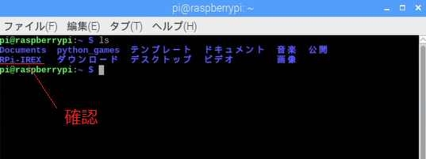

# RPi-IREX用Pythonサンプルファイル

RPi-IREXを制御するためのPythonサンプルファイルの使用方法について説明します。  
Raspberry Piは'Raspberry Pi3 ModelB'、OSは'Raspbian Stretch with desktop'で説明します。
  
  
サンプルファイルは下記の２つです。  

- irexIn.py  
赤外線リモコン信号を学習するために使用します
  
- irexOut.py  
赤外線リモコン信号を出力するために使用します  
  
***
## 準備
### Raspberry PiにRPi-IREXを接続
[README.md](../setup/README.md)を参考に下記の準備をおこなってください。  

- 'Raspberry Pi'に'RPi-IREX'を接続  
- OS('Raspbian)のアップデート
- GPIO40pinのUART設定(GPIO40pin接続の場合)
- 'RPi-IREX'が'Raspberry Pi'に認識されていることを確認
  
### pyserialインストール  
Pythonでシリアル通信するためにpyserialをインストールします。
```
$ sudo pip3 install pyserial  
```

### RPi.GPIOインストール  
PythonでGPIO制御するためにRPi.GPIOをインストールします。
```
$ sudo pip3 install rpi.gpio  
```

### Pythonサンプルファイルを実行するディレクトリを作成します。
1. 'mkdir'コマンドを使って'RPi-IREX'という名前のディレクトリを作成します。(ディレクトリ名や作成場所は自由です)
```
$ mkdir RPi-IREX  
```

2. 'ls'コマンドを実行して'RPi-IREX'ディレクトリが作成されていること確認します。
```
$ ls  
```


3. 'cd'コマンドで'RPi-IREX'ディレクトリに移動します。
```
$ cd RPi-IREX  
```

### PythonサンプルファイルをGitHubからダウンロード  
GitHubからPythonサンプルファイルをダウンロードします。
1. irexIn.pyをダウンロード
```
$ wget https://github.com/ratocsystems/rpi-irex/raw/master/python/irexIn.py  
```  

2. irexOut.pyをダウンロード
```
$ wget https://github.com/ratocsystems/rpi-irex/raw/master/python/irexOut.py  
```  

3. 'ls'コマンドを実行してPythonサンプルファイル(irexIn.py, irexOut.py)がダウンロードされていることを確認します。
```
$ ls  
```
  
***
## Pythonサンプルファイルの使い方
サンプルファイルは、Python3で実行します。  
### irexIn.py
赤外線リモコンの信号をファイルに保存するために使用します。  
機能は下記の通りです。

- **デバイスファイルの指定**  
    引数に`'-d'`を使用して、デバイスファイルを指定します。  
    'Raspberry Pi'と'RPi-IREX'をGPIO40pinで接続する場合は、**必ず設定が必要です**。  
    Raspberry Pi 3のGPIO40pinのUART(TXD0/RXD0)を使用する場合は、`ttyS0`を指定します。  
    *USB接続の場合は、自動で検索・設定しますので、特に設定する必要はありません。*  
    `例) -d /dev/ttyS0`  
      
- **赤外線リモコン信号の学習を開始、ファイルに保存**  
    引数に`'-f'`を使用して、赤外線リモコン信号を保存するファイル名を指定します。  
    保存した信号が判断しやすいファイル名にしてください。  
    JSONファイルで出力されますので、指定するファイルの拡張子は`.json`にしてください。  
    引数に`'-f'`を付けてirexIn.pyを実行すると、赤外線リモコン信号を学習するモードになります。  
    学習モード中は、RPi-IREXのLED2が赤色に点灯しますので、学習させたい赤外線リモコンをRPi-IREXの受光部に向けて信号を出力してください。  LED2が消灯したら学習が完了です。  
    *学習モードは15秒でタイムアウトします*  
    `例) -f tvOn.json`

- **RPi-IREXのファームウェアバージョン取得**  
    引数に`'-v'`を使用するとRPi-IREXのファームウェアのバージョンを取得することができます。  
    `例) -v`
    
- **RPi-IREXのハードウェアリセット**  
    引数に`'-r'`を使用するとRPi-IREXをハードウェアリセットすることができます。 
    起動時や誤動作した場合に使用してください。  
    *ハードウェアリセット機能はGPIO 40pinのGPIOを使用しますので、USB接続時は使用できません。*  *また、GPIOを使用していますので、デバイスファイルの指定は必要ありません。*  
    `例) -r`

### irexOut.py
ファイルに保存された赤外線リモコン信号を出力するために使用します。  
機能は下記の通りです。  

- **デバイスファイルの指定**  
    引数に`'-d'`を使用して、デバイスファイルを指定します。  
    'Raspberry Pi'と'RPi-IREX'をGPIO40pinで接続する場合は、**必ず設定が必要です**。  
    Raspberry Pi 3のGPIO40pinのUART(TXD0/RXD0)を使用する場合は、`ttyS0`を指定します。  
    *USB接続の場合は、自動で検索・設定しますので、特に設定する必要はありません。*  
    `例) -d /dev/ttyS0` 

- **赤外線リモコン信号ファイルを読込み、出力**  
    引数に`'-f'`を使用して、赤外線リモコン信号ファイルから信号データを読み込みます。  
    irexIn.pyで学習したファイル名を指定してください。  
    引数に`'-f'`を付けてirexOut.pyを実行すると、指定した赤外線リモコン信号ファイルの赤外線信号が出力されます。  
    赤外線信号出力時は、RPi-IREXのLED1が点滅します。    
    `例) -f tvOn.json`

- **RPi-IREXのファームウェアバージョン取得**  
    引数に`'-v'`を使用するとRPi-IREXのファームウェアのバージョンを取得することができます。  
    `例) -v`
    
- **RPi-IREXのハードウェアリセット**  
    引数に`'-r'`を使用するとRPi-IREXをハードウェアリセットすることができます。 
    起動時や誤動作した場合に使用してください。  
    *ハードウェアリセット機能はGPIO 40pinのGPIOを使用しますので、USB接続時は使用できません。*  *また、GPIOを使用していますので、デバイスファイルの指定は必要ありません。*  
    `例) -r`

***
## Pythonサンプルファイル実行例
サンプルファイルの前に、`'python3'`をつけて実行します。

- **リセット(GPIO 40pin接続のみ)**  

```
python3 irexIn.py -r
または
python3 irexOut.py -r
```

- **ファームウェアバージョン取得**  

    GPIO 40pin接続

    ```
    python3 irexIn.py -d /dev/ttyS0 -v
    または
    python3 irexOut.py -d /dev/ttyS0 -v
    ```  

    USB接続

    ```
    python3 irexIn.py -v
    または
    python3 irexOut.py -v
    ```

- **赤外線リモコン学習**

    GPIO 40pin接続

    ```
    python3 irexIn.py -d /dev/ttyS0 -f irData.json
    ```

    USB接続

    ```
    python3 irexIn.py -f irData.json
    ```

- **赤外線リモコン信号出力**

    GPIO 40pin接続

    ```
    python3 irexOut.py -d /dev/ttyS0 -f irData.json
    ```

    USB接続

    ```
    python3 irexOut.py -f irData.json
    ```


