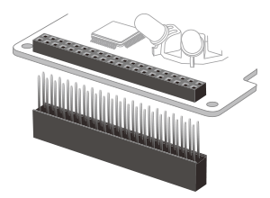
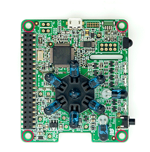
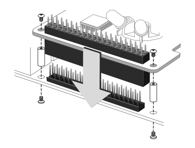
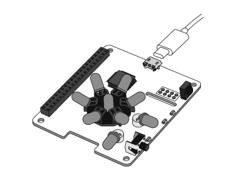
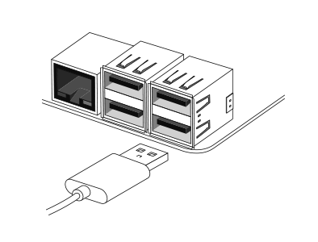

## **本体の接続**  

---

### **接続方法**  
本製品の接続には "GPIO" を使用した UART接続と、USB接続２つのパターンが用意されています。ここでは、それぞれの接続方法をご説明します。  

---
### **接続したい方法をお選び下さい**  
[「GPIO 40PIN」を使った接続方法](#gpio40)  
[「USB」を使った接続方法](#usb)  

---

#### **a）GPIO 40PINを使った接続方法**  
GPIO接続の場合は、RPi-IREXに付属の40PINピンヘッダーをリモコン基板本体に装着します。  
  
ピンヘッダの先端は尖っていますので怪我には十分注意してください。  

次にRaspberry Piの GPIOピンヘッダと本製品を接続します。  
スペーサー（付属）を本製品本体のネジ穴にあわせ、同じく付属するネジ（4本）で固定します。固定がおわれば、Raspberry PiのGPIOピンへ垂直に差し込みます。  
  
  
スペーサーがRaspberry Pi基板に合わされば接続は完了です。  
あとはRaspberry Piの背面より、残りのネジ（4本）を使用し、スペーサーを固定すれば完成です。  
   
※接続イメージ  
※反対側もイメージ図と同様に固定してください。  
※GPIO（UART）接続の場合、USBに接続する必要はありません。  

---

#### **b）USBを使った接続方法**  
USB接続の場合は、RaspberryPi本体のUSBポートから本製品のmicroUSBポートへUSBケーブル（標準A ⇔ micro-B）で接続してください。  
  
本製品とは、USB micro-B で接続します。  

   
Raspberry Piとは標準Aコネクタで接続します。  
※USB接続の場合、GPIO40PINに接続する必要はありません。  

---

つづいて、学習リモコンのRaspberry Piで使用するための準備をおこないます。  
**Raspberry PiのOS（RASPBIAN）がすでにセットアップ済みの方は「[こちら](./RASP_CONFIG.md)」**  
**これからRaspberry PiのOS（RASPBIAN)をセットアップされる方は「[こちら](../install/README.md)」**  
